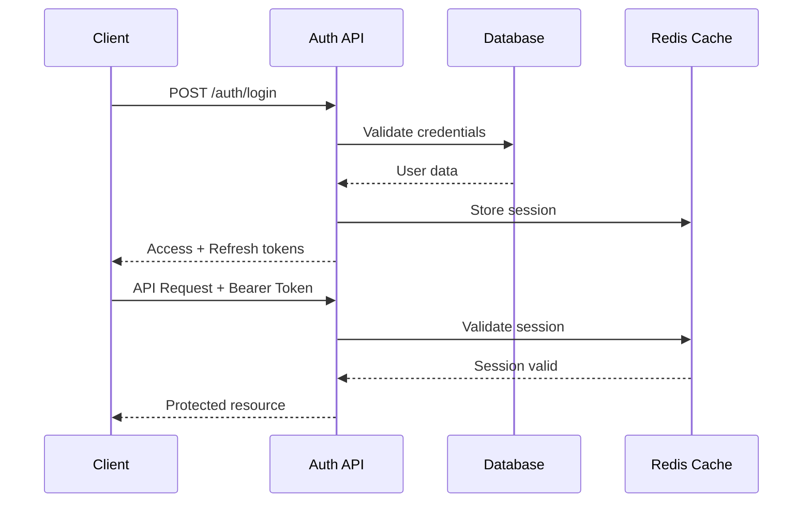

# 🔌 API Specification - WhatsApp Cloud Landing

> **Framework**: Next.js 15 API Routes  
> **Version**: v1  
> **Base URL**: `/api/v1`  
> **Authentication**: JWT Bearer Token  
> **Content-Type**: `application/json`

## 📋 Resumen de la API

Esta especificación define **40+ endpoints REST** organizados por dominio, diseñados para soportar el sistema completo de WhatsApp Cloud Landing desde autenticación hasta analytics avanzados.

### 🎯 Principios de Diseño
- **RESTful**: Verbos HTTP semánticamente correctos
- **Consistente**: Respuestas estandarizadas y códigos de estado uniformes  
- **Versionado**: URL versioning con backward compatibility
- **Seguro**: Autenticación JWT + rate limiting + validación de entrada
- **Observable**: Logging comprehensivo y métricas de performance

---

## 🔐 Autenticación y Autorización

### Authentication Flow



### Token Structure

```typescript
interface AuthTokens {
  accessToken: string;    // JWT, 15 min expiry
  refreshToken: string;   // JWT, 7 days expiry  
  tokenType: 'Bearer';
  expiresIn: 900;        // seconds
}

interface JWTPayload {
  sub: string;           // user ID
  email: string;         // user email
  iat: number;          // issued at
  exp: number;          // expires at
  sessionId: string;    // Redis session key
}
```

---

## 🚪 Authentication Endpoints

### POST `/api/v1/auth/register`
Crear nueva cuenta de usuario.

**Request Body:**
```typescript
{
  email: string;                    // Valid email format
  password: string;                 // Min 8 chars, mixed case, numbers
  firstName: string;                // 2-50 chars
  lastName: string;                 // 2-50 chars  
  acceptsTerms: boolean;           // Must be true
  marketingEmails?: boolean;       // Default: true
}
```

**Response 201:**
```typescript
{
  success: true;
  data: {
    user: {
      id: string;
      email: string;
      firstName: string;
      lastName: string;
      emailVerified: false;
      createdAt: string;
    };
    tokens: AuthTokens;
  };
  message: "Usuario registrado exitosamente. Revisa tu email para verificar la cuenta.";
}
```

**Response 400:**
```typescript
{
  success: false;
  error: {
    code: "VALIDATION_ERROR";
    message: "Datos de entrada inválidos";
    details: {
      email?: string[];
      password?: string[];
      firstName?: string[];
    };
  };
}
```

**Response 409:**
```typescript
{
  success: false;
  error: {
    code: "EMAIL_ALREADY_EXISTS";
    message: "Ya existe una cuenta con este email";
  };
}
```

---

### POST `/api/v1/auth/login`
Iniciar sesión con credenciales.

**Request Body:**
```typescript
{
  email: string;
  password: string;
  rememberMe?: boolean;    // Extends refresh token to 30 days
}
```

**Response 200:**
```typescript
{
  success: true;
  data: {
    user: {
      id: string;
      email: string;
      firstName: string;
      lastName: string;
      emailVerified: boolean;
      onboardingCompleted: boolean;
    };
    tokens: AuthTokens;
  };
}
```

**Response 401:**
```typescript
{
  success: false;
  error: {
    code: "INVALID_CREDENTIALS";
    message: "Email o contraseña incorrectos";
  };
}
```

**Response 423:**
```typescript
{
  success: false;
  error: {
    code: "ACCOUNT_LOCKED";
    message: "Cuenta bloqueada por intentos fallidos";
    details: {
      lockedUntil: string;    // ISO datetime
      remainingTime: number;   // seconds
    };
  };
}
```

---

### POST `/api/v1/auth/refresh`
Renovar access token usando refresh token.

**Request Body:**
```typescript
{
  refreshToken: string;
}
```

**Response 200:**
```typescript
{
  success: true;
  data: {
    tokens: AuthTokens;
  };
}
```

---

### POST `/api/v1/auth/logout`
Cerrar sesión y invalidar tokens.

**Headers:**
```
Authorization: Bearer <access_token>
```

**Response 200:**
```typescript
{
  success: true;
  message: "Sesión cerrada exitosamente";
}
```

---

### POST `/api/v1/auth/forgot-password`
Solicitar restablecimiento de contraseña.

**Request Body:**
```typescript
{
  email: string;
}
```

**Response 200:**
```typescript
{
  success: true;
  message: "Si el email existe, recibirás un enlace de restablecimiento";
}
```

---

### POST `/api/v1/auth/reset-password`
Restablecer contraseña con token.

**Request Body:**
```typescript
{
  token: string;       // From reset email
  newPassword: string; // Min 8 chars, mixed case, numbers
}
```

**Response 200:**
```typescript
{
  success: true;
  message: "Contraseña actualizada exitosamente";
}
```

---

## 👤 User Management Endpoints

### GET `/api/v1/users/profile`
Obtener perfil del usuario autenticado.

**Headers:**
```
Authorization: Bearer <access_token>
```

**Response 200:**
```typescript
{
  success: true;
  data: {
    id: string;
    email: string;
    firstName: string;
    lastName: string;
    phoneNumber?: string;
    timezone: string;
    language: string;
    avatarUrl?: string;
    emailVerified: boolean;
    twoFactorEnabled: boolean;
    onboardingCompleted: boolean;
    marketingEmails: boolean;
    createdAt: string;
    updatedAt: string;
  };
}
```

---

### PUT `/api/v1/users/profile`
Actualizar perfil del usuario.

**Request Body:**
```typescript
{
  firstName?: string;
  lastName?: string;
  phoneNumber?: string;      // E.164 format
  timezone?: string;         // IANA timezone
  language?: string;         // ISO 639-1 code
  marketingEmails?: boolean;
}
```

**Response 200:**
```typescript
{
  success: true;
  data: {
    // Updated user profile
  };
  message: "Perfil actualizado exitosamente";
}
```

---

### POST `/api/v1/users/change-password`
Cambiar contraseña del usuario.

**Request Body:**
```typescript
{
  currentPassword: string;
  newPassword: string;
}
```

**Response 200:**
```typescript
{
  success: true;
  message: "Contraseña actualizada exitosamente";
}
```

---

### DELETE `/api/v1/users/account`
Eliminar cuenta del usuario.

**Request Body:**
```typescript
{
  password: string;
  confirmation: "DELETE_MY_ACCOUNT";
}
```

**Response 200:**
```typescript
{
  success: true;
  message: "Cuenta eliminada exitosamente";
}
```

---

## 🏢 Business Management Endpoints

### GET `/api/v1/businesses`
Obtener negocios del usuario.

**Response 200:**
```typescript
{
  success: true;
  data: Array<{
    id: string;
    name: string;
    sector: string;
    employeeCount: string;
    monthlyClients: string;
    phoneNumber?: string;
    websiteUrl?: string;
    status: 'active' | 'suspended' | 'cancelled';
    verificationStatus: string;
    createdAt: string;
  }>;
}
```

---

### POST `/api/v1/businesses`
Crear nuevo negocio.

**Request Body:**
```typescript
{
  name: string;                    // 2-255 chars
  sector: 'retail' | 'healthcare' | 'restaurant' | 'education' | 'other';
  employeeCount: '1-10' | '11-50' | '51-200' | '201-1000' | '1000+';
  monthlyClients: '0-100' | '100-500' | '500-2000' | '2000-10000' | '10000+';
  phoneNumber?: string;            // E.164 format
  countryCode?: string;           // ISO 3166-1 alpha-2
  websiteUrl?: string;            // Valid URL
  description?: string;           // Max 1000 chars
}
```

**Response 201:**
```typescript
{
  success: true;
  data: {
    id: string;
    name: string;
    sector: string;
    status: 'active';
    verificationStatus: 'pending';
    createdAt: string;
  };
  message: "Negocio creado exitosamente";
}
```

---

### GET `/api/v1/businesses/:id`
Obtener detalles de un negocio específico.

**Response 200:**
```typescript
{
  success: true;
  data: {
    id: string;
    name: string;
    sector: string;
    employeeCount: string;
    monthlyClients: string;
    phoneNumber?: string;
    countryCode?: string;
    websiteUrl?: string;
    description?: string;
    businessHours: object;
    status: string;
    verificationStatus: string;
    whatsappConfig?: {
      phoneNumber: string;
      verified: boolean;
      status: string;
    };
    botConfig?: {
      name: string;
      active: boolean;
    };
    createdAt: string;
    updatedAt: string;
  };
}
```

---

### PUT `/api/v1/businesses/:id`
Actualizar negocio.

**Request Body:**
```typescript
{
  name?: string;
  sector?: string;
  phoneNumber?: string;
  websiteUrl?: string;
  description?: string;
  businessHours?: object;
}
```

**Response 200:**
```typescript
{
  success: true;
  data: {
    // Updated business data
  };
  message: "Negocio actualizado exitosamente";
}
```

---

## 📱 WhatsApp Integration Endpoints

### GET `/api/v1/whatsapp/config/:businessId`
Obtener configuración WhatsApp del negocio.

**Response 200:**
```typescript
{
  success: true;
  data: {
    id: string;
    phoneNumberId: string;
    phoneNumber: string;
    displayName?: string;
    verified: boolean;
    status: 'pending' | 'active' | 'suspended' | 'failed';
    rateLimitTier: string;
    lastVerifiedAt?: string;
    createdAt: string;
  };
}
```

**Response 404:**
```typescript
{
  success: false;
  error: {
    code: "WHATSAPP_CONFIG_NOT_FOUND";
    message: "No se ha configurado WhatsApp para este negocio";
  };
}
```

---

### POST `/api/v1/whatsapp/config/:businessId`
Configurar WhatsApp para un negocio.

**Request Body:**
```typescript
{
  phoneNumberId: string;        // From Meta for Developers
  businessAccountId: string;    // WhatsApp Business Account ID
  accessToken: string;          // Meta access token
  phoneNumber: string;          // E.164 format
  displayName?: string;         // Display name for WhatsApp
}
```

**Response 201:**
```typescript
{
  success: true;
  data: {
    id: string;
    phoneNumber: string;
    status: 'pending';
    webhookUrl: string;
    verifyToken: string;
  };
  message: "Configuración WhatsApp creada. Configura el webhook en Meta for Developers.";
}
```

---

### POST `/api/v1/whatsapp/verify/:businessId`
Verificar configuración WhatsApp.

**Response 200:**
```typescript
{
  success: true;
  data: {
    verified: boolean;
    status: string;
    phoneNumber: string;
    rateLimitTier: string;
  };
  message: "Verificación completada";
}
```

---

### POST `/api/v1/whatsapp/webhook`
Webhook para recibir mensajes de WhatsApp.

**Request Body:**
```typescript
{
  object: 'whatsapp_business_account';
  entry: Array<{
    id: string;
    changes: Array<{
      value: {
        messaging_product: 'whatsapp';
        metadata: {
          display_phone_number: string;
          phone_number_id: string;
        };
        messages?: Array<WhatsAppMessage>;
        statuses?: Array<WhatsAppMessageStatus>;
      };
      field: 'messages';
    }>;
  }>;
}
```

**Response 200:**
```typescript
{
  success: true;
  message: "Webhook procesado";
}
```

---

### GET `/api/v1/whatsapp/webhook`
Verificación de webhook de WhatsApp.

**Query Parameters:**
- `hub.mode=subscribe`
- `hub.challenge=<challenge_string>`
- `hub.verify_token=<verify_token>`

**Response 200:**
```typescript
// Returns hub.challenge string
```

---

## 💬 Conversations & Messages Endpoints

### GET `/api/v1/conversations/:businessId`
Obtener conversaciones del negocio.

**Query Parameters:**
- `page?: number` (default: 1)
- `limit?: number` (default: 20, max: 100)
- `status?: 'active' | 'archived' | 'blocked'`
- `search?: string` (busca en nombre/teléfono)

**Response 200:**
```typescript
{
  success: true;
  data: Array<{
    id: string;
    whatsappContactId: string;
    contactName?: string;
    contactPhone: string;
    status: string;
    lastMessageAt?: string;
    messageCount: number;
    unreadCount: number;
    tags: string[];
    customerSatisfactionScore?: number;
    createdAt: string;
  }>;
  meta: {
    pagination: {
      page: number;
      limit: number;
      total: number;
      totalPages: number;
    };
  };
}
```

---

### GET `/api/v1/conversations/:businessId/:conversationId`
Obtener detalles de conversación específica.

**Response 200:**
```typescript
{
  success: true;
  data: {
    id: string;
    contactName?: string;
    contactPhone: string;
    status: string;
    messageCount: number;
    unreadCount: number;
    tags: string[];
    contextSummary?: string;
    customerSatisfactionScore?: number;
    createdAt: string;
    updatedAt: string;
  };
}
```

---

### GET `/api/v1/messages/:conversationId`
Obtener mensajes de una conversación.

**Query Parameters:**
- `page?: number` (default: 1)
- `limit?: number` (default: 50, max: 100)  
- `before?: string` (ISO datetime, para paginación)

**Response 200:**
```typescript
{
  success: true;
  data: Array<{
    id: string;
    whatsappMessageId?: string;
    direction: 'inbound' | 'outbound';
    messageType: 'text' | 'image' | 'audio' | 'video' | 'document';
    content?: string;
    mediaUrl?: string;
    mediaMimeType?: string;
    status: 'pending' | 'sent' | 'delivered' | 'read' | 'failed';
    aiGenerated: boolean;
    processingTimeMs?: number;
    createdAt: string;
  }>;
  meta: {
    pagination: {
      page: number;
      limit: number;
      hasMore: boolean;
    };
  };
}
```

---

### POST `/api/v1/messages/:conversationId/send`
Enviar mensaje en una conversación.

**Request Body:**
```typescript
{
  messageType: 'text' | 'template';
  content?: string;                    // Required for text messages
  templateName?: string;               // Required for template messages
  templateVariables?: object;          // Template variable values
}
```

**Response 201:**
```typescript
{
  success: true;
  data: {
    id: string;
    whatsappMessageId: string;
    status: 'pending';
    createdAt: string;
  };
  message: "Mensaje enviado";
}
```

---

## 🤖 Bot Management Endpoints

### GET `/api/v1/bots/:businessId`
Obtener configuración del bot.

**Response 200:**
```typescript
{
  success: true;
  data: {
    id: string;
    name: string;
    welcomeMessage: string;
    responseTime: 'instant' | 'quick' | 'normal' | 'delayed';
    enableKeywords: boolean;
    keywords: string[];
    personalityPrompt?: string;
    maxContextTurns: number;
    fallbackMessage: string;
    llmProvider: 'openai' | 'anthropic' | 'deepseek';
    llmModel: string;
    temperature: number;
    active: boolean;
    businessContext: object;
    createdAt: string;
    updatedAt: string;
  };
}
```

---

### PUT `/api/v1/bots/:businessId`
Actualizar configuración del bot.

**Request Body:**
```typescript
{
  name?: string;
  welcomeMessage?: string;
  responseTime?: 'instant' | 'quick' | 'normal' | 'delayed';
  enableKeywords?: boolean;
  keywords?: string[];
  personalityPrompt?: string;
  fallbackMessage?: string;
  llmProvider?: 'openai' | 'anthropic' | 'deepseek';
  llmModel?: string;
  temperature?: number;    // 0.0 - 2.0
  active?: boolean;
  businessContext?: object;
}
```

**Response 200:**
```typescript
{
  success: true;
  data: {
    // Updated bot config
  };
  message: "Configuración del bot actualizada";
}
```

---

### POST `/api/v1/bots/:businessId/test`
Probar respuesta del bot.

**Request Body:**
```typescript
{
  message: string;                     // Test message
  context?: object;                    // Optional conversation context
}
```

**Response 200:**
```typescript
{
  success: true;
  data: {
    response: string;
    processingTimeMs: number;
    tokensUsed: number;
    contextUsed: object;
  };
}
```

---

## 💳 Billing & Subscriptions Endpoints

### GET `/api/v1/billing/plans`
Obtener planes de suscripción disponibles.

**Response 200:**
```typescript
{
  success: true;
  data: Array<{
    id: string;
    name: 'starter' | 'pro' | 'enterprise';
    priceMonthly: number;
    priceYearly: number;
    currency: 'EUR' | 'USD';
    features: {
      messagesPerMonth: number;
      contactsLimit: number;
      aiResponses: boolean;
      analyticsAdvanced: boolean;
      teamMembers: number;
      support: 'email' | 'priority' | 'dedicated';
    };
    popular?: boolean;
  }>;
}
```

---

### POST `/api/v1/billing/subscribe`
Crear nueva suscripción.

**Request Body:**
```typescript
{
  planType: 'starter' | 'pro' | 'enterprise';
  billingCycle: 'monthly' | 'yearly';
  paymentMethodId?: string;            // Stripe payment method ID
}
```

**Response 201:**
```typescript
{
  success: true;
  data: {
    subscriptionId: string;
    clientSecret?: string;              // For 3D Secure
    status: 'active' | 'requires_action';
    trialEnd?: string;
    currentPeriodEnd: string;
  };
  message: "Suscripción creada exitosamente";
}
```

---

### GET `/api/v1/billing/subscription`
Obtener suscripción actual del usuario.

**Response 200:**
```typescript
{
  success: true;
  data: {
    id: string;
    planType: string;
    billingCycle: string;
    status: string;
    currentPeriodStart: string;
    currentPeriodEnd: string;
    cancelAtPeriodEnd: boolean;
    trialEnd?: string;
    pricePerMonthCents: number;
    currency: string;
    nextInvoiceDate?: string;
    nextInvoiceAmount?: number;
  };
}
```

---

### PUT `/api/v1/billing/subscription`
Actualizar suscripción.

**Request Body:**
```typescript
{
  planType?: 'starter' | 'pro' | 'enterprise';
  billingCycle?: 'monthly' | 'yearly';
}
```

**Response 200:**
```typescript
{
  success: true;
  data: {
    // Updated subscription
  };
  message: "Suscripción actualizada";
}
```

---

### POST `/api/v1/billing/cancel`
Cancelar suscripción.

**Request Body:**
```typescript
{
  cancelAtPeriodEnd: boolean;          // true = cancel at end, false = cancel now
  cancellationReason?: string;
}
```

**Response 200:**
```typescript
{
  success: true;
  data: {
    status: 'canceled' | 'active';
    canceledAt?: string;
    currentPeriodEnd: string;
  };
  message: "Suscripción cancelada";
}
```

---

### GET `/api/v1/billing/invoices`
Obtener facturas del usuario.

**Query Parameters:**
- `page?: number` (default: 1)
- `limit?: number` (default: 20)

**Response 200:**
```typescript
{
  success: true;
  data: Array<{
    id: string;
    number: string;
    status: 'paid' | 'open' | 'void' | 'draft';
    amountPaid: number;
    amountDue: number;
    currency: string;
    periodStart: string;
    periodEnd: string;
    invoiceDate: string;
    dueDate?: string;
    hostedInvoiceUrl?: string;
    invoicePdf?: string;
  }>;
  meta: {
    pagination: {
      page: number;
      limit: number;
      total: number;
    };
  };
}
```

---

### POST `/api/v1/billing/webhook/stripe`
Webhook de Stripe para eventos de billing.

**Headers:**
- `stripe-signature: <webhook_signature>`

**Response 200:**
```typescript
{
  received: true;
}
```

---

## 📊 Analytics Endpoints

### POST `/api/v1/analytics/events`
Registrar evento de analytics.

**Request Body:**
```typescript
{
  eventType: string;                   // e.g., 'page_view', 'button_click'
  eventData?: object;                  // Additional event properties
  sessionId?: string;
  pageUrl?: string;
  referrerUrl?: string;
}
```

**Response 201:**
```typescript
{
  success: true;
  message: "Evento registrado";
}
```

---

### GET `/api/v1/analytics/dashboard/:businessId`
Obtener métricas del dashboard.

**Query Parameters:**
- `period?: 'today' | 'week' | 'month' | 'quarter' | 'year'`
- `startDate?: string` (ISO date)
- `endDate?: string` (ISO date)

**Response 200:**
```typescript
{
  success: true;
  data: {
    overview: {
      totalConversations: number;
      activeConversations: number;
      totalMessages: number;
      messagesSent: number;
      messagesReceived: number;
      averageResponseTime: number;     // minutes
      customerSatisfaction: number;    // 1-5 scale
    };
    trends: {
      conversationsGrowth: number;     // percentage
      messagesGrowth: number;
      responseTimeImprovement: number;
    };
    messagesByDay: Array<{
      date: string;
      sent: number;
      received: number;
    }>;
    topConversations: Array<{
      id: string;
      contactName: string;
      messageCount: number;
      lastMessageAt: string;
    }>;
    botPerformance: {
      totalResponses: number;
      averageAccuracy: number;
      humanHandoffRate: number;
    };
  };
}
```

---

### GET `/api/v1/analytics/conversations/:businessId`
Analytics de conversaciones.

**Query Parameters:**
- `period?: string`
- `groupBy?: 'day' | 'week' | 'month'`

**Response 200:**
```typescript
{
  success: true;
  data: Array<{
    date: string;
    newConversations: number;
    activeConversations: number;
    resolvedConversations: number;
    averageResponseTime: number;
    customerSatisfaction: number;
  }>;
}
```

---

### GET `/api/v1/analytics/usage/:businessId`
Métricas de uso para billing.

**Response 200:**
```typescript
{
  success: true;
  data: {
    currentPeriod: {
      startDate: string;
      endDate: string;
      messagesSent: number;
      messagesReceived: number;
      apiCalls: number;
      aiRequests: number;
      storageUsedMB: number;
    };
    limits: {
      messagesPerMonth: number;
      apiCallsPerMonth: number;
      aiRequestsPerMonth: number;
      storageMaxMB: number;
    };
    usage: {
      messagesUsagePercent: number;
      apiCallsUsagePercent: number;
      aiRequestsUsagePercent: number;
      storageUsagePercent: number;
    };
  };
}
```

---

## 🔧 Admin & System Endpoints

### GET `/api/v1/admin/health`
Health check del sistema.

**Response 200:**
```typescript
{
  success: true;
  data: {
    status: 'healthy' | 'degraded' | 'unhealthy';
    timestamp: string;
    services: {
      database: {
        status: 'healthy';
        responseTime: number;
        connections: number;
      };
      redis: {
        status: 'healthy';
        responseTime: number;
        memory: number;
      };
      whatsapp: {
        status: 'healthy';
        rateLimitRemaining: number;
      };
      stripe: {
        status: 'healthy';
      };
    };
    version: string;
    uptime: number;
  };
}
```

---

### GET `/api/v1/admin/metrics`
Métricas del sistema (admin only).

**Response 200:**
```typescript
{
  success: true;
  data: {
    api: {
      totalRequests: number;
      averageResponseTime: number;
      errorRate: number;
      rateLimit: {
        requestsPerMinute: number;
        throttledRequests: number;
      };
    };
    database: {
      activeConnections: number;
      slowQueries: number;
      cacheHitRate: number;
    };
    messaging: {
      messagesInQueue: number;
      processingRate: number;
      failureRate: number;
    };
    users: {
      totalUsers: number;
      activeUsers24h: number;
      registrations24h: number;
    };
  };
}
```

---

## ⚡ Rate Limiting

### Limits por Endpoint

```typescript
const rateLimits = {
  // Authentication
  'POST /api/v1/auth/login': '5 per minute per IP',
  'POST /api/v1/auth/register': '3 per minute per IP',
  'POST /api/v1/auth/forgot-password': '3 per 5 minutes per IP',
  
  // General API
  'GET /api/v1/*': '100 per minute per user',
  'POST /api/v1/*': '60 per minute per user',
  'PUT /api/v1/*': '60 per minute per user',
  'DELETE /api/v1/*': '10 per minute per user',
  
  // WhatsApp messaging
  'POST /api/v1/messages/*/send': '30 per minute per business',
  'POST /api/v1/whatsapp/webhook': '1000 per minute global',
  
  // Analytics
  'POST /api/v1/analytics/events': '200 per minute per user',
  
  // Billing
  'POST /api/v1/billing/subscribe': '3 per hour per user',
  'POST /api/v1/billing/webhook/stripe': '1000 per minute global'
};
```

### Rate Limit Headers

```
X-RateLimit-Limit: 100
X-RateLimit-Remaining: 99
X-RateLimit-Reset: 1635724800
```

### Rate Limit Response

```typescript
// HTTP 429 - Too Many Requests
{
  success: false;
  error: {
    code: "RATE_LIMIT_EXCEEDED";
    message: "Demasiadas solicitudes. Inténtalo de nuevo en un momento.";
    details: {
      limit: 100;
      remaining: 0;
      resetTime: 1635724800;
    };
  };
}
```

---

## 🚨 Error Handling

### Error Response Format

```typescript
interface ApiError {
  success: false;
  error: {
    code: string;                      // Machine-readable error code
    message: string;                   // Human-readable message in Spanish
    details?: any;                     // Additional error context
    requestId?: string;                // For debugging
  };
}
```

### Common Error Codes

```typescript
const ERROR_CODES = {
  // Validation
  VALIDATION_ERROR: 'Datos de entrada inválidos',
  MISSING_REQUIRED_FIELD: 'Campo requerido faltante',
  INVALID_FORMAT: 'Formato inválido',
  
  // Authentication  
  INVALID_CREDENTIALS: 'Credenciales inválidas',
  TOKEN_EXPIRED: 'Token expirado',
  TOKEN_INVALID: 'Token inválido',
  INSUFFICIENT_PERMISSIONS: 'Permisos insuficientes',
  
  // Resources
  RESOURCE_NOT_FOUND: 'Recurso no encontrado',
  RESOURCE_ALREADY_EXISTS: 'Recurso ya existe',
  RESOURCE_CONFLICT: 'Conflicto con recurso existente',
  
  // Business Logic
  BUSINESS_LIMIT_EXCEEDED: 'Límite de negocios excedido',
  SUBSCRIPTION_REQUIRED: 'Suscripción requerida',
  FEATURE_NOT_AVAILABLE: 'Función no disponible en tu plan',
  
  // External Services
  WHATSAPP_API_ERROR: 'Error en WhatsApp API',
  STRIPE_ERROR: 'Error en procesamiento de pagos',
  AI_SERVICE_ERROR: 'Error en servicio de IA',
  
  // System
  INTERNAL_SERVER_ERROR: 'Error interno del servidor',
  SERVICE_UNAVAILABLE: 'Servicio no disponible',
  MAINTENANCE_MODE: 'Sistema en mantenimiento'
};
```

### HTTP Status Codes

```typescript
const STATUS_CODES = {
  200: 'OK - Solicitud exitosa',
  201: 'Created - Recurso creado',
  204: 'No Content - Acción completada sin contenido',
  
  400: 'Bad Request - Solicitud inválida',
  401: 'Unauthorized - Autenticación requerida',
  403: 'Forbidden - Acceso denegado',
  404: 'Not Found - Recurso no encontrado',
  409: 'Conflict - Conflicto con estado actual',
  422: 'Unprocessable Entity - Datos inválidos',
  423: 'Locked - Recurso bloqueado',
  429: 'Too Many Requests - Rate limit excedido',
  
  500: 'Internal Server Error - Error interno',
  502: 'Bad Gateway - Error de gateway',
  503: 'Service Unavailable - Servicio no disponible',
  504: 'Gateway Timeout - Timeout de gateway'
};
```

---

## 📝 Request/Response Examples

### Complete Onboarding Flow

```typescript
// 1. Register user
POST /api/v1/auth/register
{
  "email": "juan@mitienda.com",
  "password": "MiPassword123!",
  "firstName": "Juan",
  "lastName": "Pérez",
  "acceptsTerms": true
}

// 2. Create business
POST /api/v1/businesses
{
  "name": "Mi Tienda",
  "sector": "retail",
  "employeeCount": "1-10",
  "monthlyClients": "100-500",
  "phoneNumber": "+34123456789"
}

// 3. Configure WhatsApp
POST /api/v1/whatsapp/config/550e8400-e29b-41d4-a716-446655440001
{
  "phoneNumberId": "123456789012345",
  "businessAccountId": "987654321098765",
  "accessToken": "EAAG...",
  "phoneNumber": "+34123456789",
  "displayName": "Mi Tienda"
}

// 4. Configure bot
PUT /api/v1/bots/550e8400-e29b-41d4-a716-446655440001
{
  "name": "Asistente de Mi Tienda",
  "welcomeMessage": "¡Hola! Soy el asistente de Mi Tienda. ¿En qué puedo ayudarte?",
  "personalityPrompt": "Eres un asistente amable y profesional de una tienda de retail...",
  "active": true
}

// 5. Subscribe to plan
POST /api/v1/billing/subscribe
{
  "planType": "starter",
  "billingCycle": "monthly"
}
```

---

## 🔒 Security Considerations

### Input Validation
- Todos los inputs validados con Zod schemas
- Sanitización de strings para prevenir XSS
- Rate limiting por endpoint y usuario
- CORS configurado restrictivamente

### Authentication Security
- JWT tokens con expiración corta (15 min)
- Refresh tokens seguros con rotación
- Session invalidation en logout
- Password requirements estrictos

### Data Protection
- Row Level Security (RLS) en todas las tablas
- Encriptación de tokens y datos sensibles
- Logs sin información personal identificable
- GDPR compliance con data export/deletion

---

Esta especificación API proporciona una base completa y escalable para el sistema WhatsApp Cloud Landing, con todas las funcionalidades necesarias desde MVP hasta enterprise scale.