# 🏗️ Arquitectura Backend - WhatsApp Cloud Landing

> **Diseñada por**: backend-architect agent  
> **Fecha**: 29 de Agosto, 2025  
> **Estado**: Especificación técnica completa para implementación

## 📋 Resumen Ejecutivo

Esta arquitectura backend está diseñada para llevar el proyecto del **0% actual a 100% funcional** con una base escalable desde MVP hasta enterprise. Utiliza tecnologías probadas del ecosistema Next.js 15 y sigue principios de Domain-Driven Design.

### 🎯 Objetivos Principales
- **Rapidez de desarrollo**: MVP en 8 semanas
- **Escalabilidad**: Desde 10 hasta 10,000+ usuarios
- **Mantenibilidad**: Clean Architecture + DDD
- **Seguridad**: Enterprise-grade desde el día 1

---

## 🏛️ Arquitectura General del Sistema

### Diagrama de Servicios

```mermaid
graph TB
    CLIENT[Cliente Next.js Frontend]
    API[API Gateway / Next.js API Routes]
    
    subgraph "🎯 Servicios de Dominio"
        AUTH[🔐 Auth Service]
        USER[👤 User Service]
        BUSINESS[🏢 Business Service]
        WHATSAPP[📱 WhatsApp Service]
        BOT[🤖 Bot Service]
        BILLING[💳 Billing Service]
        ANALYTICS[📊 Analytics Service]
        NOTIFICATION[📬 Notification Service]
    end
    
    subgraph "🌐 Integraciones Externas"
        META[Meta WhatsApp API]
        STRIPE[Stripe API]
        OPENAI[OpenAI API]
        EMAIL[Resend Email API]
    end
    
    subgraph "💾 Infraestructura"
        SUPABASE[(Supabase PostgreSQL)]
        REDIS[(Redis Cache)]
        QUEUE[BullMQ Queue]
    end
    
    CLIENT --> API
    API --> AUTH
    API --> USER
    API --> BUSINESS
    API --> WHATSAPP
    API --> BOT
    API --> BILLING
    API --> ANALYTICS
    
    WHATSAPP --> META
    WHATSAPP --> QUEUE
    BOT --> OPENAI
    BILLING --> STRIPE
    NOTIFICATION --> EMAIL
    
    AUTH --> SUPABASE
    USER --> SUPABASE
    BUSINESS --> SUPABASE
    WHATSAPP --> SUPABASE
    BILLING --> SUPABASE
    ANALYTICS --> SUPABASE
    
    WHATSAPP --> REDIS
    BOT --> REDIS
    ANALYTICS --> REDIS
    
    style CLIENT fill:#e1f5fe
    style API fill:#f3e5f5
    style SUPABASE fill:#e8f5e8
    style REDIS fill:#fff3e0
```



### Principios Arquitectónicos

#### 1. **Domain-Driven Design (DDD)**
```
src/modules/
├── auth/           # Autenticación y autorización
├── user/           # Gestión de usuarios y perfiles
├── business/       # Datos y configuración empresarial
├── whatsapp/       # Integración WhatsApp Cloud API
├── bot/            # Inteligencia artificial y respuestas
├── billing/        # Suscripciones y pagos
├── analytics/      # Métricas y tracking
└── shared/         # Utilidades compartidas
```

#### 2. **Clean Architecture por Módulo**
```
module/
├── domain/         # Entidades y reglas de negocio
├── application/    # Casos de uso y puertos
├── infra/         # Adaptadores e integraciones
└── ui/            # Componentes React específicos
```

#### 3. **Separación de Responsabilidades**
- **Frontend**: UI, estado local, navegación
- **API Layer**: Validación, autenticación, orchestration
- **Business Logic**: Casos de uso, reglas de dominio
- **Infrastructure**: Base de datos, integraciones externas

---

## 🛠️ Stack Tecnológico

### Backend Core
```json
{
  "runtime": "Next.js 15 + TypeScript",
  "database": {
    "primary": "Supabase (PostgreSQL 15)",
    "rationale": "Auth integrado, RLS, real-time, edge functions, escalabilidad automática"
  },
  "cache": {
    "primary": "Upstash Redis",
    "rationale": "Serverless, compatible con Vercel, baja latencia para sesiones"
  },
  "queue": {
    "primary": "BullMQ + Redis",
    "rationale": "Procesamiento asíncrono de mensajes, retry automático, monitoreo"
  },
  "authentication": {
    "primary": "Supabase Auth + JWT",
    "rationale": "Row Level Security, escalable, compatible con Next.js"
  }
}
```

### Integraciones Externas
```json
{
  "payments": {
    "provider": "Stripe",
    "features": "Subscripciones, webhooks, customer portal, facturación automática"
  },
  "messaging": {
    "provider": "WhatsApp Cloud API",
    "features": "Mensajes, webhooks, templates, verificación de números"
  },
  "ai": {
    "provider": "OpenAI GPT-4",
    "features": "Respuestas inteligentes, context management, personalización"
  },
  "email": {
    "provider": "Resend",
    "features": "Transaccionales, templates React, deliverability alta"
  },
  "monitoring": {
    "provider": "Sentry + Vercel Analytics",
    "features": "Error tracking, performance monitoring, alertas"
  }
}
```

---

## 🔐 Seguridad y Autenticación

### Estrategia de Autenticación
```typescript
// JWT Token Strategy
interface AuthTokens {
  accessToken: string;    // 15 minutos
  refreshToken: string;   // 7 días
  sessionId: string;      // Redis session key
}

// Multi-factor Authentication
interface User2FA {
  enabled: boolean;
  secret: string;         // TOTP secret
  backupCodes: string[];  // Recovery codes
  lastVerified: Date;
}
```

### Row Level Security (RLS)
```sql
-- Ejemplo: Solo usuarios pueden ver sus propios negocios
CREATE POLICY businesses_owner_access ON businesses 
  FOR ALL USING (owner_id = auth.uid());

-- Ejemplo: Mensajes solo visibles por dueños del negocio  
CREATE POLICY messages_business_access ON messages 
  FOR ALL USING (
    conversation_id IN (
      SELECT id FROM conversations 
      WHERE business_id IN (
        SELECT id FROM businesses 
        WHERE owner_id = auth.uid()
      )
    )
  );
```

### API Security
```typescript
// Rate Limiting por endpoint
const rateLimits = {
  '/api/auth/login': '5 per minute per IP',
  '/api/auth/register': '3 per minute per IP', 
  '/api/whatsapp/send': '100 per minute per user',
  '/api/webhooks/whatsapp': '1000 per minute global',
  '/api/analytics/events': '200 per minute per user'
};

// Input validation con Zod
const createBusinessSchema = z.object({
  name: z.string().min(2).max(100),
  sector: z.enum(['retail', 'healthcare', 'restaurant', 'other']),
  phone_number: z.string().regex(/^\+[1-9]\d{8,14}$/),
  employee_count: z.enum(['1-10', '11-50', '51-200', '200+'])
});
```

---

## 📱 Integración WhatsApp Cloud API

### Arquitectura de Mensajería


### Webhook Configuration
```typescript
// Webhook endpoint structure
interface WhatsAppWebhook {
  object: 'whatsapp_business_account';
  entry: Array<{
    id: string; // Business Account ID
    changes: Array<{
      value: {
        messaging_product: 'whatsapp';
        metadata: {
          display_phone_number: string;
          phone_number_id: string;
        };
        messages?: WhatsAppMessage[];
        statuses?: WhatsAppMessageStatus[];
      };
      field: 'messages';
    }>;
  }>;
}

// Message processing job
interface MessageProcessingJob {
  businessId: string;
  conversationId: string;
  inboundMessage: WhatsAppMessage;
  context: ConversationContext;
  retryCount: number;
}
```

### Queue System (BullMQ)
```typescript
// Message processing queue
const messageQueue = new Queue('whatsapp-messages', {
  connection: redisConnection,
  defaultJobOptions: {
    attempts: 3,
    backoff: {
      type: 'exponential', 
      delay: 2000,
    },
    removeOnComplete: 100,
    removeOnFail: 50,
  },
});

// Job processor
messageQueue.process('process-message', async (job) => {
  const { businessId, inboundMessage } = job.data;
  
  // 1. Load conversation context
  // 2. Generate AI response 
  // 3. Send via WhatsApp API
  // 4. Save to database
  // 5. Update analytics
});
```

---

## 💳 Sistema de Billing y Pagos

### Integración Stripe
```typescript
// Subscription management
interface SubscriptionPlan {
  id: string;
  name: 'starter' | 'pro' | 'enterprise';
  price: number;
  currency: 'EUR' | 'USD';
  billing: 'monthly' | 'yearly';
  features: {
    messages_per_month: number;
    contacts_limit: number;
    ai_responses: boolean;
    analytics_advanced: boolean;
    team_members: number;
  };
}

// Usage-based billing
interface UsageRecord {
  business_id: string;
  metric: 'messages_sent' | 'api_calls' | 'storage_mb';
  quantity: number;
  period_start: Date;
  period_end: Date;
}
```

### Webhook Stripe
```typescript
// Stripe webhook handler
app.post('/api/webhooks/stripe', async (req, res) => {
  const event = stripe.webhooks.constructEvent(
    req.body,
    req.headers['stripe-signature'],
    process.env.STRIPE_WEBHOOK_SECRET
  );

  switch (event.type) {
    case 'customer.subscription.created':
      await handleSubscriptionCreated(event.data.object);
      break;
    case 'customer.subscription.updated': 
      await handleSubscriptionUpdated(event.data.object);
      break;
    case 'invoice.payment_failed':
      await handlePaymentFailed(event.data.object);
      break;
  }
  
  res.json({ received: true });
});
```

---

## 📊 Analytics y Monitoreo

### Event Tracking
```typescript
// Analytics event structure
interface AnalyticsEvent {
  business_id: string;
  event_type: string;
  event_data: Record<string, any>;
  session_id?: string;
  user_agent?: string;
  ip_address?: string;
  timestamp: Date;
}

// Common events
const EVENTS = {
  // User actions
  USER_REGISTERED: 'user_registered',
  ONBOARDING_STEP_COMPLETED: 'onboarding_step_completed',
  BUSINESS_CREATED: 'business_created',
  
  // WhatsApp events  
  WHATSAPP_CONNECTED: 'whatsapp_connected',
  MESSAGE_SENT: 'message_sent',
  MESSAGE_RECEIVED: 'message_received',
  
  // Billing events
  SUBSCRIPTION_CREATED: 'subscription_created',
  PAYMENT_SUCCEEDED: 'payment_succeeded',
  
  // Bot events
  BOT_RESPONSE_GENERATED: 'bot_response_generated',
  AI_REQUEST_MADE: 'ai_request_made'
};
```

### Performance Monitoring
```typescript
// Database performance tracking
const dbMetrics = {
  query_duration: 'histogram',
  active_connections: 'gauge', 
  slow_queries: 'counter',
  cache_hit_rate: 'gauge'
};

// API response times
const apiMetrics = {
  response_time_ms: 'histogram',
  requests_per_second: 'gauge',
  error_rate: 'gauge',
  active_users: 'gauge'
};
```

---

## ⚡ Optimización de Performance

### Estrategias de Caching
```typescript
// Multi-layer caching strategy
const cacheStrategy = {
  // 1. Browser cache (HTTP headers)
  static_assets: 'max-age=31536000, immutable', // 1 año
  api_responses: 'max-age=60, stale-while-revalidate=300', // 1 min
  
  // 2. Redis application cache  
  user_sessions: 7 * 24 * 60 * 60, // 7 días
  api_data: 5 * 60, // 5 minutos
  conversation_context: 24 * 60 * 60, // 24 horas
  analytics_data: 30 * 60, // 30 minutos
  
  // 3. Database optimizations
  connection_pool: { min: 5, max: 20 },
  query_timeout: 10000, // 10 segundos
  statement_timeout: 30000 // 30 segundos
};
```

### Database Optimization
```sql
-- Índices críticos para performance
CREATE INDEX CONCURRENTLY idx_messages_conversation_created 
  ON messages(conversation_id, created_at DESC);

CREATE INDEX CONCURRENTLY idx_conversations_business_updated
  ON conversations(business_id, last_message_at DESC);

CREATE INDEX CONCURRENTLY idx_analytics_business_date
  ON analytics_events(business_id, DATE(created_at));

-- Particionamiento para tablas grandes (futuro)
CREATE TABLE messages_2025_q1 PARTITION OF messages
  FOR VALUES FROM ('2025-01-01') TO ('2025-04-01');
```

---

## 🚀 Escalabilidad y Arquitectura Futura

### Horizontal Scaling Strategy
```typescript
// Evolution path del sistema
const scalingPhases = {
  phase_1: {
    users: '0-1,000',
    architecture: 'Monolithic Next.js',
    infrastructure: 'Supabase + Vercel',
    bottlenecks: 'Ninguno esperado'
  },
  
  phase_2: {
    users: '1,000-10,000', 
    architecture: 'Modular monolith',
    infrastructure: 'Supabase + Redis cluster',
    optimizations: ['Read replicas', 'Connection pooling', 'Advanced caching']
  },
  
  phase_3: {
    users: '10,000-100,000',
    architecture: 'Microservices extraction', 
    infrastructure: 'Multi-region deployment',
    extracted_services: ['WhatsApp Service', 'AI Service', 'Analytics Service']
  },
  
  phase_4: {
    users: '100,000+',
    architecture: 'Event-driven microservices',
    infrastructure: 'Kubernetes + Event streaming',
    technologies: ['Apache Kafka', 'Service mesh', 'Advanced monitoring']
  }
};
```

### Bottleneck Identification
```typescript
// Potential bottlenecks y soluciones
const bottlenecks = {
  whatsapp_rate_limits: {
    problem: 'Meta API rate limits per phone number',
    solution: 'Smart queuing + multiple phone numbers'
  },
  
  database_writes: {
    problem: 'High volume message inserts', 
    solution: 'Batch inserts + write replicas'
  },
  
  ai_api_calls: {
    problem: 'OpenAI API rate limits + latency',
    solution: 'Response caching + multiple API keys'
  },
  
  session_storage: {
    problem: 'Redis memory limits',
    solution: 'Redis cluster + TTL optimization'
  }
};
```

---

## 🔧 DevOps y Deployment

### Environment Strategy
```typescript
// Environment configuration
const environments = {
  development: {
    database: 'Supabase local',
    redis: 'Local Redis',
    whatsapp: 'Test credentials',
    stripe: 'Test mode',
    ai: 'OpenAI dev key'
  },
  
  staging: {
    database: 'Supabase staging project',
    redis: 'Upstash staging',
    whatsapp: 'WhatsApp test business account',
    stripe: 'Test mode', 
    ai: 'OpenAI staging key'
  },
  
  production: {
    database: 'Supabase production',
    redis: 'Upstash production cluster',
    whatsapp: 'WhatsApp production API',
    stripe: 'Live mode',
    ai: 'OpenAI production key'
  }
};
```

### Monitoring Stack
```typescript
// Comprehensive monitoring
const monitoring = {
  application: 'Sentry (errors + performance)',
  infrastructure: 'Vercel Analytics (traffic + vitals)', 
  database: 'Supabase built-in monitoring',
  business: 'Custom dashboard (React + Chart.js)',
  
  alerts: {
    error_rate: '>5% en 5 minutos',
    response_time: '>500ms promedio',
    database_connections: '>80% del límite', 
    queue_length: '>1000 mensajes pendientes',
    payment_failures: '>10% en 1 hora'
  }
};
```

---

## 📋 Implementación por Fases

### Sprint 1-2: Fundación (Semanas 1-2)
```typescript
const sprint1_2 = {
  database: [
    'Setup Supabase project y configuración',
    'Crear esquema completo con migraciones',
    'Configurar Row Level Security policies',
    'Setup local development environment'
  ],
  
  authentication: [
    'Implementar Supabase Auth',
    'Sistema JWT + refresh tokens',
    'Session management con Redis',
    'APIs de login/register/forgot password'
  ],
  
  core_apis: [
    'API de gestión usuarios y perfiles',
    'API de gestión businesses', 
    'API básica de onboarding',
    'Middleware de validación y rate limiting'
  ]
};
```

### Sprint 3-4: WhatsApp Integration (Semanas 3-4)
```typescript
const sprint3_4 = {
  whatsapp_setup: [
    'Meta for Developers app configuration',
    'WhatsApp Business Account setup',
    'Webhook endpoint implementación',
    'Phone number verification flow'
  ],
  
  messaging: [
    'Send message API functionality',
    'Receive webhook processing', 
    'BullMQ queue system setup',
    'Message storage y retrieval'
  ],
  
  basic_bot: [
    'OpenAI integration básica',
    'Context management simple',
    'Fallback responses', 
    'Bot configuration API'
  ]
};
```

### Sprint 5-6: Billing y Advanced Features (Semanas 5-6)
```typescript
const sprint5_6 = {
  stripe_integration: [
    'Stripe account y product setup',
    'Subscription creation y management',
    'Webhook handling completo',
    'Customer portal integration'
  ],
  
  usage_tracking: [
    'Message counting y limits',
    'Usage-based billing preparation', 
    'Plan enforcement logic',
    'Billing dashboard APIs'
  ],
  
  analytics: [
    'Event tracking system',
    'Basic dashboard APIs',
    'Performance metrics collection',
    'Business intelligence queries'
  ]
};
```

---

## 🎯 Métricas de Éxito Técnico

### Performance Benchmarks
```typescript
const benchmarks = {
  api_response_time: {
    target: '<200ms average',
    critical: '<500ms 99th percentile'
  },
  
  database_queries: {
    target: '<100ms average', 
    critical: '<500ms 95th percentile'
  },
  
  message_processing: {
    target: '<2 seconds end-to-end',
    critical: '<5 seconds worst case'
  },
  
  uptime: {
    target: '99.9% monthly',
    critical: '99.5% minimum'
  }
};
```

### Scalability Targets
```typescript
const scalabilityTargets = {
  concurrent_users: 1000,
  messages_per_second: 100,
  api_requests_per_second: 500,
  database_connections: 50,
  
  // Growth targets
  year_1: '10,000 registered users',
  year_2: '100,000 messages processed monthly', 
  year_3: 'Multi-region deployment'
};
```

---

## ✅ Checklist de Arquitectura

### Pre-implementación
- [ ] Stack tecnológico definido y aprobado
- [ ] Cuentas y servicios externos configurados  
- [ ] Environment variables documentadas
- [ ] Database schema finalizado
- [ ] API contracts documentados

### Durante implementación
- [ ] Tests unitarios para cada módulo
- [ ] Integration tests para APIs críticas
- [ ] Security audit de autenticación
- [ ] Performance testing bajo carga
- [ ] Error handling comprehensivo

### Pre-lanzamiento
- [ ] Monitoring y alertas configuradas
- [ ] Backup y recovery procedures
- [ ] Rate limiting probado
- [ ] Scaling procedures documentados
- [ ] Rollback plan establecido

---

Esta arquitectura proporciona una base sólida y escalable que lleva el proyecto del estado actual (0% backend) a un sistema enterprise-ready manteniendo la velocidad de desarrollo y la calidad técnica.