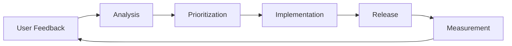
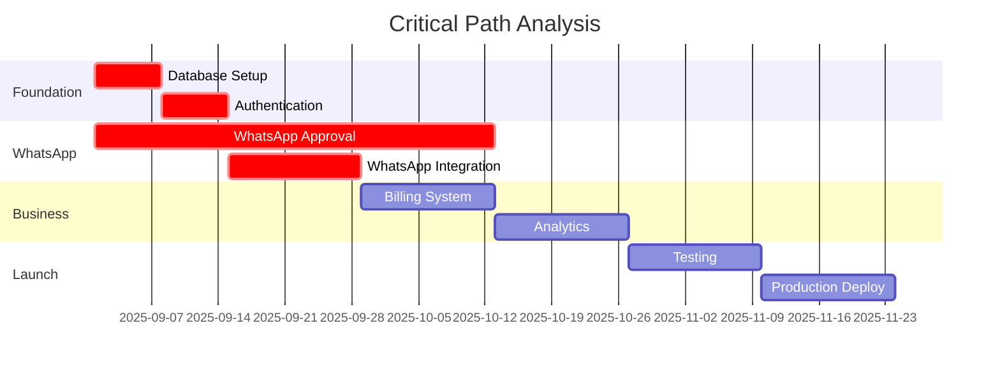

# 🗺️ Implementation Roadmap - WhatsApp Cloud Landing

> **Timeline**: 12-16 semanas para MVP completo  
> **Metodología**: Sprints de 2 semanas con entregables funcionales  
> **Estado Actual**: 30% completado (Frontend UI)  
> **Próximo Hito**: Backend Foundation (4 semanas)

## 📊 Resumen Ejecutivo

Esta roadmap detalla la implementación completa del sistema WhatsApp Cloud Landing desde el estado actual hasta un producto enterprise-ready. Prioriza entregables de valor incremental y reduce riesgos críticos.

### 🎯 Objetivos por Fase
- **Semanas 1-4**: Foundation sólida (backend + DB + auth)
- **Semanas 5-8**: Core features (WhatsApp + bot básico)  
- **Semanas 9-12**: Business features (billing + analytics)
- **Semanas 13-16**: Polish + Launch (testing + deployment)

---

## 🏃‍♂️ Sprint 0: Setup y Preparación (Semana 0)

### Objetivos
Preparar el entorno de desarrollo y configurar herramientas básicas antes de comenzar desarrollo backend.

### Tareas Críticas

#### Equipo y Recursos
- [ ] **Contratar Backend Developer Senior** (CRÍTICO - debe empezar Semana 1)
- [ ] **Setup de herramientas de desarrollo**
  - GitHub repository access para nuevo dev
  - Development environment setup guide
  - Code review process establecido
- [ ] **Definir arquitectura técnica final**
  - Review completa de documentación técnica creada
  - Alignment entre frontend existente y backend planificado

#### Servicios Externos (Iniciar ASAP)
- [ ] **Meta for Developers - WhatsApp Business API**
  - Crear Facebook App
  - Configurar Business Manager
  - **Iniciar proceso de verificación** (4-6 semanas de lead time)
- [ ] **Supabase Project Setup**
  - Crear proyecto production y staging
  - Configurar authentication
  - Setup initial database structure
- [ ] **Stripe Account Configuration**
  - Business verification
  - Products and pricing setup
  - Test webhooks configuration

#### Planning Detallado
- [ ] **Breakdown de todas las user stories**
- [ ] **Estimation de esfuerzo por feature**
- [ ] **Risk assessment y mitigation plans**
- [ ] **Definition of Done para cada sprint**

### Deliverables Semana 0
✅ Team completo y onboarded  
✅ Servicios externos en proceso de setup  
✅ Development environment funcionando  
✅ Sprint 1 planning completado  

---

## 🏗️ Sprint 1-2: Backend Foundation (Semanas 1-2)

### Objetivo
Establecer la infraestructura backend sólida que soportará todo el desarrollo futuro.

### Sprint 1 (Semana 1): Database & Authentication

#### Database Setup
- [ ] **Supabase Production Setup**
  - [ ] Configure production database
  - [ ] Setup database schema from docs/database-schema.md  
  - [ ] Implement Row Level Security policies
  - [ ] Create database migrations system
  - [ ] Setup automated backups

- [ ] **Development Database**
  - [ ] Local development with Docker Compose
  - [ ] Seed scripts with test data
  - [ ] Database connection pooling
  - [ ] Performance monitoring setup

#### Authentication System
- [ ] **Supabase Auth Integration**
  - [ ] User registration/login flow
  - [ ] Email verification system
  - [ ] Password reset functionality
  - [ ] JWT token management
  - [ ] Session handling con Redis

- [ ] **API Authentication Middleware**
  - [ ] JWT validation middleware
  - [ ] Rate limiting implementation
  - [ ] CORS configuration
  - [ ] Request validation con Zod

#### Development Infrastructure  
- [ ] **Environment Configuration**
  - [ ] Environment variables management
  - [ ] Multi-environment setup (dev/staging/prod)
  - [ ] Secrets management
  - [ ] Logging configuration

- [ ] **Code Quality Setup**
  - [ ] ESLint + Prettier configuration
  - [ ] TypeScript strict mode
  - [ ] Pre-commit hooks con Husky
  - [ ] CI/CD pipeline básico

**Sprint 1 Success Criteria:**
- ✅ Users can register/login successfully
- ✅ Database schema deployed and accessible
- ✅ Development environment fully functional
- ✅ All authentication endpoints working

### Sprint 2 (Semana 2): Core APIs & Business Logic

#### User Management APIs
- [ ] **User Profile Management**
  - [ ] GET/PUT /api/v1/users/profile
  - [ ] Password change functionality  
  - [ ] Profile picture upload
  - [ ] Account deletion

#### Business Management APIs
- [ ] **Business CRUD Operations**
  - [ ] POST /api/v1/businesses (create business)
  - [ ] GET /api/v1/businesses (list user businesses)
  - [ ] PUT /api/v1/businesses/:id (update business)
  - [ ] Business validation logic

#### Onboarding System
- [ ] **Onboarding Session Management**
  - [ ] Onboarding flow state persistence
  - [ ] Step-by-step progress tracking
  - [ ] Session expiration handling
  - [ ] Onboarding completion logic

- [ ] **Connect Frontend to Backend**
  - [ ] Replace mock APIs with real endpoints
  - [ ] Update Redux actions to call real APIs
  - [ ] Error handling and loading states
  - [ ] Form validation integration

#### API Infrastructure
- [ ] **OpenAPI Documentation**
  - [ ] Auto-generated API docs
  - [ ] Request/response examples
  - [ ] Testing playground
  - [ ] Client SDK generation

- [ ] **Testing Framework**
  - [ ] Unit tests for business logic
  - [ ] Integration tests for APIs
  - [ ] Test database setup
  - [ ] Automated testing in CI

**Sprint 2 Success Criteria:**
- ✅ Complete onboarding flow works end-to-end
- ✅ Business creation and management functional
- ✅ Frontend connected to real backend APIs
- ✅ Comprehensive test coverage (>80%)

---

## 📱 Sprint 3-4: WhatsApp Integration (Semanas 3-4)

### Objetivo
Implementar la integración completa con WhatsApp Cloud API y funcionalidad básica de bot.

### Sprint 3 (Semana 3): WhatsApp API Foundation

#### WhatsApp API Setup
- [ ] **Meta for Developers Configuration**
  - [ ] Complete business verification process
  - [ ] Configure WhatsApp Business Account
  - [ ] Setup phone number and display name
  - [ ] Generate and configure access tokens

- [ ] **WhatsApp Client Library**
  - [ ] Implement WhatsAppClient class
  - [ ] Send text messages functionality
  - [ ] Send media messages (images, documents)
  - [ ] Message status tracking
  - [ ] Error handling and retry logic

#### Webhook System
- [ ] **Webhook Endpoint Implementation**
  - [ ] POST /api/webhooks/whatsapp
  - [ ] Signature verification
  - [ ] Message parsing and validation
  - [ ] Webhook event logging

- [ ] **Message Queue System (BullMQ)**
  - [ ] Setup Redis for queue management
  - [ ] Inbound message processing queue
  - [ ] Outbound message sending queue  
  - [ ] Queue monitoring and admin interface
  - [ ] Error handling and dead letter queues

#### Database Integration
- [ ] **WhatsApp Configuration Management**
  - [ ] Store WhatsApp credentials securely
  - [ ] Phone number verification system
  - [ ] Configuration validation
  - [ ] Multi-business WhatsApp support

**Sprint 3 Success Criteria:**
- ✅ Can send/receive WhatsApp messages programmatically
- ✅ Webhook processing working reliably
- ✅ Message queue system operational
- ✅ WhatsApp config management complete

### Sprint 4 (Semana 4): Conversations & Bot Intelligence

#### Conversation Management
- [ ] **Conversation & Message Storage**
  - [ ] Create conversations from inbound messages
  - [ ] Message threading and history
  - [ ] Contact information management
  - [ ] Conversation status tracking

- [ ] **Conversation APIs**
  - [ ] GET /api/v1/conversations/:businessId
  - [ ] GET /api/v1/messages/:conversationId
  - [ ] POST /api/v1/messages/:conversationId/send
  - [ ] Real-time message updates

#### Bot Intelligence System
- [ ] **OpenAI Integration**
  - [ ] Bot response generation
  - [ ] Context management system
  - [ ] Personality prompt configuration
  - [ ] Conversation memory (Redis cache)

- [ ] **Bot Configuration**
  - [ ] Bot personality setup per business
  - [ ] Welcome message configuration
  - [ ] Fallback responses  
  - [ ] Human handoff triggers
  - [ ] Bot enable/disable functionality

#### Message Processing Pipeline
- [ ] **Intelligent Message Routing**
  - [ ] Automatic bot response generation
  - [ ] Context-aware conversations
  - [ ] Sentiment analysis integration
  - [ ] Human handoff detection

- [ ] **Performance Optimization**
  - [ ] Message processing under 2 seconds
  - [ ] Concurrent message handling
  - [ ] Rate limit management
  - [ ] Caching optimization

**Sprint 4 Success Criteria:**
- ✅ End-to-end conversation flow functional
- ✅ Bot generates contextual responses
- ✅ Message history and threading working
- ✅ Performance targets met (< 2s response time)

---

## 💳 Sprint 5-6: Billing & Business Features (Semanas 5-6)

### Objetivo
Implementar sistema completo de billing, suscripciones y funcionalidades de negocio.

### Sprint 5 (Semana 5): Stripe Integration & Subscriptions

#### Stripe Configuration
- [ ] **Stripe Account Setup**
  - [ ] Business verification complete
  - [ ] Products and pricing configuration
  - [ ] Tax settings and compliance
  - [ ] Webhook endpoints configuration

- [ ] **Stripe SDK Integration**  
  - [ ] Payment intent creation
  - [ ] Subscription management
  - [ ] Customer portal integration
  - [ ] Invoice generation

#### Subscription Management
- [ ] **Subscription Flow Implementation**
  - [ ] Plan selection and signup
  - [ ] Payment method collection
  - [ ] Subscription creation and activation
  - [ ] Trial period management
  - [ ] Subscription upgrades/downgrades

- [ ] **Billing APIs**
  - [ ] GET /api/v1/billing/plans
  - [ ] POST /api/v1/billing/subscribe  
  - [ ] GET /api/v1/billing/subscription
  - [ ] PUT /api/v1/billing/subscription
  - [ ] POST /api/v1/billing/cancel

#### Usage Tracking System
- [ ] **Usage Metrics Collection**
  - [ ] Message count tracking per business
  - [ ] API call counting
  - [ ] Storage usage monitoring
  - [ ] Real-time usage updates

- [ ] **Plan Enforcement**
  - [ ] Usage limit checks
  - [ ] Feature access control
  - [ ] Overage handling
  - [ ] Plan restriction enforcement

**Sprint 5 Success Criteria:**
- ✅ Complete subscription flow functional
- ✅ Payment processing working
- ✅ Usage tracking and limits enforced
- ✅ Stripe webhooks handling all events

### Sprint 6 (Semana 6): Analytics & Advanced Features

#### Analytics Dashboard
- [ ] **Business Metrics Collection**
  - [ ] Message volume analytics
  - [ ] Conversation metrics
  - [ ] Response time tracking
  - [ ] Customer satisfaction scoring

- [ ] **Analytics APIs**
  - [ ] GET /api/v1/analytics/dashboard/:businessId
  - [ ] GET /api/v1/analytics/conversations/:businessId
  - [ ] GET /api/v1/analytics/usage/:businessId
  - [ ] Real-time metrics endpoints

#### Advanced Bot Features
- [ ] **Message Templates System**
  - [ ] Template creation and approval
  - [ ] WhatsApp template sync
  - [ ] Template usage tracking
  - [ ] A/B testing for templates

- [ ] **Advanced AI Features**
  - [ ] Conversation summarization
  - [ ] Sentiment analysis
  - [ ] Intent classification
  - [ ] Automated tagging

#### Business Intelligence  
- [ ] **Reporting System**
  - [ ] Daily/weekly/monthly reports
  - [ ] Email report delivery
  - [ ] Export functionality (CSV/PDF)
  - [ ] Custom date range analysis

- [ ] **Performance Monitoring**
  - [ ] System health dashboard
  - [ ] Error tracking and alerts
  - [ ] Performance metrics
  - [ ] Uptime monitoring

**Sprint 6 Success Criteria:**
- ✅ Analytics dashboard showing real metrics
- ✅ Advanced bot features operational  
- ✅ Reporting system functional
- ✅ Performance monitoring active

---

## 🧪 Sprint 7-8: Testing & Quality Assurance (Semanas 7-8)

### Objetivo  
Comprehensive testing, bug fixing, security audit, y performance optimization.

### Sprint 7 (Semana 7): Comprehensive Testing

#### Test Suite Development
- [ ] **Unit Testing**
  - [ ] Business logic unit tests (>90% coverage)
  - [ ] API endpoint testing  
  - [ ] Database operation testing
  - [ ] WhatsApp client testing with mocks

- [ ] **Integration Testing**
  - [ ] End-to-end user flows
  - [ ] WhatsApp webhook processing
  - [ ] Stripe payment flows
  - [ ] Email notification system

#### Load Testing & Performance
- [ ] **Performance Testing**
  - [ ] API response time optimization
  - [ ] Database query optimization
  - [ ] Message processing throughput
  - [ ] Concurrent user testing

- [ ] **Load Testing**
  - [ ] Simulate high message volume
  - [ ] Database performance under load
  - [ ] Queue system stress testing
  - [ ] Rate limit testing

#### Security Testing
- [ ] **Security Audit**
  - [ ] Authentication/authorization testing
  - [ ] Input validation testing
  - [ ] SQL injection prevention
  - [ ] XSS and CSRF protection
  - [ ] API security testing

**Sprint 7 Success Criteria:**
- ✅ All tests passing with >90% coverage
- ✅ Performance benchmarks met
- ✅ Security vulnerabilities addressed
- ✅ Load testing successful

### Sprint 8 (Semana 8): Bug Fixing & Polish

#### Bug Resolution
- [ ] **Critical Bug Fixes**
  - [ ] Payment processing edge cases
  - [ ] WhatsApp message delivery issues
  - [ ] Authentication/session problems
  - [ ] Data consistency issues

- [ ] **User Experience Polish**
  - [ ] Error message improvements
  - [ ] Loading state optimizations
  - [ ] Mobile responsiveness fixes
  - [ ] Accessibility improvements

#### Documentation & Training
- [ ] **User Documentation**
  - [ ] User onboarding guides
  - [ ] WhatsApp setup tutorials
  - [ ] Bot configuration help
  - [ ] Billing and subscription guides

- [ ] **Technical Documentation**
  - [ ] API documentation updates
  - [ ] Deployment guides
  - [ ] Troubleshooting guides
  - [ ] Architecture decision records

#### Monitoring & Alerting
- [ ] **Production Monitoring**
  - [ ] Application performance monitoring
  - [ ] Error tracking setup
  - [ ] Business metrics dashboards
  - [ ] Alerting rules configuration

**Sprint 8 Success Criteria:**
- ✅ All critical bugs resolved
- ✅ User experience polished
- ✅ Documentation complete
- ✅ Monitoring and alerting active

---

## 🚀 Sprint 9-10: Pre-Launch & Deployment (Semanas 9-10)

### Objetivo
Preparar y ejecutar el lanzamiento en producción con usuarios beta.

### Sprint 9 (Semana 9): Production Infrastructure

#### Production Environment Setup
- [ ] **Infrastructure Deployment**
  - [ ] Production database setup con backups
  - [ ] Redis cluster configuration
  - [ ] CDN setup para assets estáticos
  - [ ] SSL certificates y domain configuration

- [ ] **CI/CD Pipeline**
  - [ ] Automated testing in pipeline
  - [ ] Staging environment deployment
  - [ ] Production deployment automation
  - [ ] Database migration automation
  - [ ] Rollback procedures

#### Security & Compliance
- [ ] **Production Security**
  - [ ] Environment variables security audit
  - [ ] API rate limiting configuration
  - [ ] DDoS protection setup
  - [ ] Regular security scanning

- [ ] **Legal Compliance**
  - [ ] Privacy policy implementation
  - [ ] Terms of service
  - [ ] GDPR compliance features
  - [ ] Data export/deletion functionality

#### Beta User Preparation
- [ ] **Beta Program Setup**
  - [ ] Beta user registration system
  - [ ] Feedback collection system
  - [ ] Support channel creation
  - [ ] Beta user documentation

**Sprint 9 Success Criteria:**
- ✅ Production environment fully operational
- ✅ Security and compliance requirements met
- ✅ Beta program ready to launch
- ✅ Support systems in place

### Sprint 10 (Semana 10): Beta Launch & Iteration

#### Beta Launch Execution
- [ ] **Soft Launch**
  - [ ] Launch with 20-50 beta users
  - [ ] Monitor system performance 24/7
  - [ ] Collect user feedback actively
  - [ ] Track key metrics and KPIs

- [ ] **User Support**
  - [ ] Active user support via chat/email
  - [ ] Bug reporting system
  - [ ] Feature request collection
  - [ ] User onboarding assistance

#### Rapid Iteration
- [ ] **Feedback Integration**
  - [ ] Daily bug fix deployments
  - [ ] User experience improvements
  - [ ] Feature refinements
  - [ ] Performance optimizations

- [ ] **Metrics Analysis**
  - [ ] User engagement analytics
  - [ ] Conversion funnel analysis
  - [ ] System performance metrics
  - [ ] Business metrics tracking

**Sprint 10 Success Criteria:**
- ✅ Beta launch executed successfully
- ✅ Positive user feedback (>4.0/5.0 rating)
- ✅ System stability demonstrated
- ✅ Key metrics trending positively

---

## 🎉 Sprint 11-12: Public Launch (Semanas 11-12)

### Objetivo
Lanzamiento público completo con marketing y escalamiento.

### Sprint 11 (Semana 11): Marketing Launch Preparation

#### Marketing Infrastructure
- [ ] **Content Creation**
  - [ ] Landing page optimization
  - [ ] Demo videos y tutorials
  - [ ] Case studies from beta users
  - [ ] Marketing email sequences

- [ ] **Launch Campaign Setup**
  - [ ] Social media campaign preparation
  - [ ] PR strategy execution
  - [ ] Influencer outreach program
  - [ ] Partner ecosystem development

#### Scalability Preparation
- [ ] **System Scalability**
  - [ ] Auto-scaling configuration
  - [ ] Database performance optimization
  - [ ] CDN optimization
  - [ ] Queue system scaling

- [ ] **Customer Success**
  - [ ] Customer success team training
  - [ ] Onboarding process optimization
  - [ ] Knowledge base completion
  - [ ] Support ticket system

### Sprint 12 (Semana 12): Public Launch

#### Launch Execution
- [ ] **Go-Live**
  - [ ] Public announcement
  - [ ] Marketing campaign activation
  - [ ] PR release distribution
  - [ ] Community engagement

- [ ] **Launch Monitoring**
  - [ ] 24/7 system monitoring
  - [ ] Customer support readiness
  - [ ] Performance optimization
  - [ ] Bug fix rapid deployment

#### Growth & Optimization
- [ ] **Growth Tracking**
  - [ ] User acquisition metrics
  - [ ] Conversion rate optimization
  - [ ] Customer acquisition cost
  - [ ] Lifetime value tracking

**Sprint 12 Success Criteria:**
- ✅ Public launch executed smoothly
- ✅ Target user acquisition numbers met
- ✅ System handles production load
- ✅ Positive market reception

---

## 📈 Success Metrics & KPIs

### Technical Success Metrics

#### Performance Benchmarks
```typescript
const technicalKPIs = {
  apiResponseTime: '<200ms average',
  systemUptime: '99.9% monthly',
  messageProcessingTime: '<2 seconds end-to-end',
  errorRate: '<1% of all requests',
  testCoverage: '>90% code coverage'
};
```

#### Business Success Metrics
```typescript  
const businessKPIs = {
  userAcquisition: {
    month1: '100 registered users',
    month3: '500 registered users', 
    month6: '2000 registered users'
  },
  
  conversionRates: {
    trialToSubscription: '>30%',
    onboardingCompletion: '>70%',
    userRetention30Days: '>60%'
  },
  
  revenueTargets: {
    month1: '$2,500 MRR',
    month3: '$15,000 MRR',
    month6: '$50,000 MRR'
  },
  
  userSatisfaction: {
    npsScore: '>50',
    supportRating: '>4.5/5',
    churnRate: '<5% monthly'
  }
};
```

---

## ⚠️ Risk Management & Mitigation

### Critical Risks & Mitigation Plans

#### Technical Risks
```typescript
const technicalRisks = {
  whatsappApiApproval: {
    risk: 'Meta approval process takes 4-6 weeks',
    impact: 'High - blocks core functionality',
    mitigation: 'Start immediately, have fallback with SMS/email',
    contingency: 'Build with generic messaging interface'
  },
  
  backendComplexity: {
    risk: 'Backend development more complex than estimated',
    impact: 'Medium - delays launch', 
    mitigation: 'Hire senior developer, use proven technologies',
    contingency: 'Reduce scope, focus on MVP features'
  },
  
  scaleIssues: {
    risk: 'System cant handle production load',
    impact: 'High - poor user experience',
    mitigation: 'Load testing, performance optimization',
    contingency: 'Auto-scaling, infrastructure upgrades'
  }
};
```

#### Business Risks
```typescript
const businessRisks = {
  competitorAction: {
    risk: 'Competitor launches similar product',
    impact: 'Medium - reduces market opportunity',
    mitigation: 'Fast execution, unique features',
    contingency: 'Pivot to niche market or features'
  },
  
  marketFit: {
    risk: 'Product-market fit not achieved',
    impact: 'High - business failure',
    mitigation: 'Beta testing, user feedback, iteration',
    contingency: 'Pivot features or target market'
  },
  
  teamCapacity: {
    risk: 'Team overloaded or key person leaves',
    impact: 'High - development stops',
    mitigation: 'Realistic planning, documentation, cross-training',
    contingency: 'Contractor support, timeline extension'
  }
};
```

---

## 🔄 Iteration & Feedback Loops

### Weekly Review Process

#### Development Reviews
- **Monday**: Sprint planning y task assignment
- **Wednesday**: Mid-sprint check-in y blockers
- **Friday**: Sprint review y retrospective

#### Stakeholder Updates
- **Weekly**: Progress report con métricas
- **Bi-weekly**: Demo de features completadas
- **Monthly**: Business metrics y strategy review

### Feedback Integration

#### User Feedback Loop


#### Continuous Improvement
- Daily bug fixes for critical issues
- Weekly feature improvements
- Monthly architecture reviews
- Quarterly technology stack evaluation

---

## 📋 Resource Requirements

### Team Composition

#### Core Team (Week 1-16)
```typescript
const coreTeam = {
  backendDeveloper: {
    role: 'Senior Backend Developer',
    commitment: '40h/week',
    skills: ['Node.js', 'PostgreSQL', 'WhatsApp API', 'Stripe'],
    startDate: 'Week 1',
    critical: true
  },
  
  frontendDeveloper: {
    role: 'Frontend Developer', 
    commitment: '30h/week',
    skills: ['React', 'Next.js', 'TypeScript', 'UI/UX'],
    startDate: 'Week 3',
    critical: false
  },
  
  qaEngineer: {
    role: 'QA Engineer',
    commitment: '20h/week',
    skills: ['Testing', 'Automation', 'Security'],
    startDate: 'Week 7',
    critical: false
  },
  
  productOwner: {
    role: 'Product Owner',
    commitment: '10h/week',
    skills: ['Product Management', 'User Research'],
    startDate: 'Week 1',
    critical: true
  }
};
```

#### External Support
- **WhatsApp Business Partner**: Consultation (2-3 calls)
- **Security Consultant**: Audit (1 week, Sprint 7)
- **DevOps Consultant**: Infrastructure setup (1 week, Sprint 9)

### Budget Breakdown

#### Development Costs (16 weeks)
```typescript
const budgetBreakdown = {
  personnel: {
    seniorBackendDev: '$120k/year → $37k (16 weeks)',
    frontendDev: '$100k/year → $23k (12 weeks)',
    qaEngineer: '$80k/year → $12k (8 weeks)',
    total: '$72k'
  },
  
  infrastructure: {
    supabase: '$500/month → $4k (8 months)',
    redis: '$200/month → $1.6k (8 months)', 
    vercel: '$300/month → $2.4k (8 months)',
    monitoring: '$100/month → $0.8k (8 months)',
    total: '$8.8k'
  },
  
  services: {
    whatsappConsultant: '$5k',
    securityAudit: '$15k',
    designOptimization: '$8k',
    total: '$28k'
  },
  
  grandTotal: '$108.8k for MVP launch'
};
```

---

## 🎯 Definition of Done

### Sprint Completion Criteria

#### Backend Features
- [ ] All API endpoints implemented per specification
- [ ] Unit tests written with >90% coverage
- [ ] Integration tests passing
- [ ] Security audit passed
- [ ] Performance benchmarks met
- [ ] Documentation updated

#### Frontend Integration  
- [ ] UI connected to real APIs
- [ ] Error handling implemented
- [ ] Loading states functional
- [ ] Mobile responsive
- [ ] Accessibility standards met
- [ ] User testing completed

#### Production Readiness
- [ ] Deployed to staging environment
- [ ] Load testing passed
- [ ] Security scan clean
- [ ] Monitoring configured
- [ ] Documentation complete
- [ ] Rollback plan tested

---

## 📅 Critical Path & Dependencies

### Dependency Chain


### Blockers & Mitigations
- **WhatsApp API Approval**: Start immediately, 6-week lead time
- **Backend Developer**: Critical hire, blocks all backend work
- **Stripe Integration**: Dependent on business verification
- **Security Audit**: Required before public launch

---

Esta roadmap proporciona un plan detallado y ejecutable para llevar el proyecto desde el estado actual (30% frontend) hasta un producto completo en producción, priorizando la entrega de valor incremental y la gestión proactiva de riesgos.