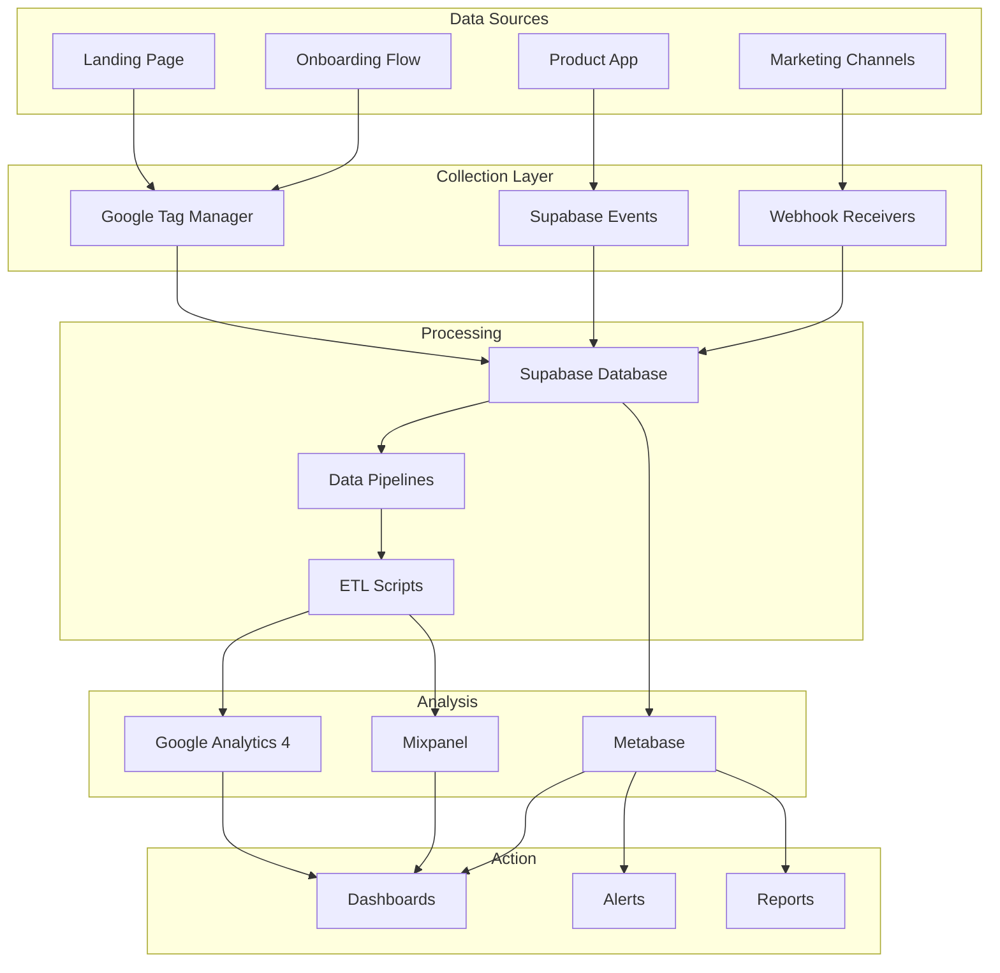

# 📊 Sistema de Métricas y Analytics – Caetaria

## 🎯 Objetivo
Establecer un sistema completo de medición y análisis para tomar decisiones basadas en datos durante todas las fases del producto.

---

## 📈 Arquitectura de Analytics

### Stack Tecnológico Completo



### Implementación Técnica

```javascript
// Cliente: Analytics Manager
class AnalyticsManager {
  constructor() {
    this.queue = [];
    this.providers = {
      gtm: window.dataLayer || [],
      mixpanel: window.mixpanel,
      custom: new SupabaseClient()
    };
  }

  track(eventName, properties = {}) {
    const enrichedEvent = {
      event: eventName,
      timestamp: new Date().toISOString(),
      sessionId: this.getSessionId(),
      userId: this.getUserId(),
      ...properties,
      // Context
      page: {
        url: window.location.href,
        title: document.title,
        referrer: document.referrer
      },
      device: {
        userAgent: navigator.userAgent,
        screenResolution: `${screen.width}x${screen.height}`,
        viewport: `${window.innerWidth}x${window.innerHeight}`
      }
    };

    // Send to all providers
    this.sendToGTM(enrichedEvent);
    this.sendToMixpanel(enrichedEvent);
    this.sendToSupabase(enrichedEvent);
  }

  // Lead scoring en tiempo real
  calculateLeadScore(leadData) {
    let score = 0;
    const weights = {
      vertical: {
        restaurant: 30,
        dental: 28,
        childcare: 25,
        clinic: 22,
        ecommerce: 20,
        other: 10
      },
      companySize: {
        '1-5': 15,
        '6-20': 30,
        '21-50': 20,
        '50+': 10
      },
      monthlyMessages: {
        '<100': 5,
        '100-500': 15,
        '500-1000': 25,
        '1000+': 35
      },
      engagement: {
        pricingViewed: 10,
        demoWatched: 15,
        contactRequested: 25,
        onboardingStarted: 30
      }
    };

    // Calculate base score
    score += weights.vertical[leadData.vertical] || 0;
    score += weights.companySize[leadData.companySizeRange] || 0;
    score += weights.monthlyMessages[leadData.messageRange] || 0;

    // Add engagement score
    Object.keys(leadData.engagement || {}).forEach(action => {
      if (leadData.engagement[action]) {
        score += weights.engagement[action] || 0;
      }
    });

    return Math.min(score, 100); // Cap at 100
  }
}
```

---

## 📊 Eventos y Métricas Clave

### Taxonomía de Eventos

```yaml
Categorías:
  acquisition:
    - page_view
    - utm_capture
    - referral_source
    
  engagement:
    - scroll_depth
    - time_on_page
    - interaction_rate
    - content_engagement
    
  conversion:
    - micro_conversion (email_capture)
    - macro_conversion (trial_start)
    - revenue_event (payment)
    
  retention:
    - session_start
    - feature_usage
    - return_visit
```

### Eventos Detallados por Fase

#### 1. Landing Page Events

```javascript
const landingPageEvents = {
  // Hero Section
  hero_view: {
    variant: 'A|B',
    headline: 'text',
    first_fold_time: 'seconds'
  },
  
  hero_cta_click: {
    button_text: 'string',
    position: 'above_fold|below_fold',
    time_to_click: 'seconds'
  },
  
  // Features Section
  feature_hover: {
    feature_name: 'string',
    hover_duration: 'milliseconds'
  },
  
  feature_click: {
    feature_name: 'string',
    action_type: 'learn_more|video|demo'
  },
  
  // Pricing Section
  pricing_view: {
    scroll_method: 'auto|manual',
    initial_plan_focus: 'starter|pro|enterprise'
  },
  
  plan_comparison: {
    plans_compared: ['starter', 'pro'],
    comparison_duration: 'seconds'
  },
  
  plan_select: {
    plan_name: 'string',
    price_point: 'number',
    billing_period: 'monthly|annual'
  },
  
  // Social Proof
  testimonial_interaction: {
    type: 'read|play_video|expand',
    testimonial_id: 'string',
    industry: 'string'
  },
  
  case_study_download: {
    industry: 'string',
    company_size: 'string'
  }
};
```

#### 2. Lead Capture Events

```javascript
const leadCaptureEvents = {
  form_impression: {
    form_type: 'inline|modal|exit_intent',
    trigger: 'auto|manual|scroll|time'
  },
  
  form_start: {
    first_field: 'string',
    prefilled_fields: 'array'
  },
  
  field_interaction: {
    field_name: 'string',
    interaction_type: 'focus|blur|change',
    time_spent: 'seconds'
  },
  
  field_error: {
    field_name: 'string',
    error_type: 'validation|required|format',
    error_message: 'string'
  },
  
  form_abandon: {
    last_field_completed: 'string',
    completion_percentage: 'number',
    time_on_form: 'seconds',
    abandon_reason: 'inferred'
  },
  
  form_submit_attempt: {
    validation_errors: 'array',
    attempt_number: 'integer'
  },
  
  form_submit_success: {
    lead_score: 'number',
    fields_completed: 'object',
    time_to_complete: 'seconds',
    utm_params: 'object'
  }
};
```

#### 3. Onboarding Flow Events

```javascript
const onboardingEvents = {
  onboarding_init: {
    entry_point: 'cta|email|direct',
    user_type: 'new|returning'
  },
  
  step_view: {
    step_number: 'integer',
    step_name: 'string',
    optional_step: 'boolean'
  },
  
  step_interaction: {
    element_type: 'input|select|toggle|button',
    element_name: 'string',
    value: 'any'
  },
  
  step_complete: {
    step_number: 'integer',
    time_on_step: 'seconds',
    validations_failed: 'integer',
    help_used: 'boolean'
  },
  
  integration_attempt: {
    service: 'whatsapp|calendar|crm',
    method: 'oauth|api_key|manual',
    attempt_number: 'integer'
  },
  
  integration_success: {
    service: 'string',
    time_to_integrate: 'seconds',
    data_synced: 'boolean'
  },
  
  onboarding_complete: {
    total_time: 'seconds',
    steps_completed: 'integer',
    steps_skipped: 'integer',
    integrations_connected: 'array',
    initial_configuration: 'object'
  },
  
  onboarding_abandon: {
    last_step: 'string',
    abandon_reason: 'timeout|frustration|technical',
    partial_data_saved: 'boolean'
  }
};
```

---

## 📉 Métricas Calculadas y KPIs

### Funnel de Conversión Principal

```sql
-- Funnel completo de conversión
WITH funnel AS (
  SELECT 
    DATE_TRUNC('day', timestamp) as date,
    COUNT(DISTINCT session_id) FILTER (WHERE event_name = 'page_view') as visitors,
    COUNT(DISTINCT session_id) FILTER (WHERE event_name = 'hero_cta_click') as cta_clicks,
    COUNT(DISTINCT session_id) FILTER (WHERE event_name = 'form_start') as form_starts,
    COUNT(DISTINCT session_id) FILTER (WHERE event_name = 'form_submit_success') as leads,
    COUNT(DISTINCT session_id) FILTER (WHERE event_name = 'onboarding_start') as onboarding_starts,
    COUNT(DISTINCT session_id) FILTER (WHERE event_name = 'onboarding_complete') as activations
  FROM events
  WHERE timestamp >= CURRENT_DATE - INTERVAL '30 days'
  GROUP BY date
)
SELECT 
  date,
  visitors,
  ROUND(100.0 * cta_clicks / NULLIF(visitors, 0), 2) as cta_rate,
  ROUND(100.0 * form_starts / NULLIF(cta_clicks, 0), 2) as form_start_rate,
  ROUND(100.0 * leads / NULLIF(form_starts, 0), 2) as form_completion_rate,
  ROUND(100.0 * onboarding_starts / NULLIF(leads, 0), 2) as onboarding_start_rate,
  ROUND(100.0 * activations / NULLIF(onboarding_starts, 0), 2) as activation_rate,
  ROUND(100.0 * activations / NULLIF(visitors, 0), 2) as overall_conversion
FROM funnel
ORDER BY date DESC;
```

### Customer Acquisition Cost (CAC)

```sql
-- CAC por canal con atribución
WITH ad_spend AS (
  SELECT 
    date,
    channel,
    SUM(spend) as total_spend
  FROM marketing_spend
  WHERE date >= CURRENT_DATE - INTERVAL '30 days'
  GROUP BY date, channel
),
conversions AS (
  SELECT 
    DATE_TRUNC('day', created_at) as date,
    last_touch_source as channel,
    COUNT(*) as new_customers,
    AVG(lead_score) as avg_lead_quality
  FROM leads
  WHERE status = 'customer'
    AND created_at >= CURRENT_DATE - INTERVAL '30 days'
  GROUP BY date, channel
)
SELECT 
  a.channel,
  SUM(a.total_spend) as total_spend,
  SUM(c.new_customers) as total_customers,
  ROUND(SUM(a.total_spend) / NULLIF(SUM(c.new_customers), 0), 2) as cac,
  ROUND(AVG(c.avg_lead_quality), 1) as avg_quality_score
FROM ad_spend a
LEFT JOIN conversions c ON a.date = c.date AND a.channel = c.channel
GROUP BY a.channel
ORDER BY cac ASC;
```

### Lead Scoring Algorithm

```python
def calculate_dynamic_lead_score(lead_id):
    """
    Calcula score dinámico basado en comportamiento + firmográficos
    """
    
    # Obtener datos del lead
    lead = db.query(f"SELECT * FROM leads WHERE id = '{lead_id}'")
    events = db.query(f"SELECT * FROM events WHERE lead_id = '{lead_id}'")
    
    score = 0
    
    # 1. Score Firmográfico (40 puntos max)
    firmographic_score = 0
    
    # Vertical
    vertical_scores = {
        'restaurant': 15,
        'dental': 14,
        'childcare': 12,
        'clinic': 11,
        'ecommerce': 10,
        'other': 5
    }
    firmographic_score += vertical_scores.get(lead.vertical, 0)
    
    # Tamaño empresa
    if 5 <= lead.company_size <= 20:
        firmographic_score += 15
    elif 20 < lead.company_size <= 50:
        firmographic_score += 10
    elif lead.company_size > 50:
        firmographic_score += 5
    
    # Volumen mensajes WhatsApp
    if lead.monthly_messages > 1000:
        firmographic_score += 10
    elif lead.monthly_messages > 500:
        firmographic_score += 7
    elif lead.monthly_messages > 100:
        firmographic_score += 4
    
    # 2. Score Comportamiento (40 puntos max)
    behavior_score = 0
    
    # Engagement con contenido
    pricing_views = count_events(events, 'pricing_view')
    behavior_score += min(pricing_views * 3, 9)
    
    demo_watched = count_events(events, 'demo_watch')
    behavior_score += min(demo_watched * 5, 10)
    
    case_study_downloaded = count_events(events, 'case_study_download')
    behavior_score += min(case_study_downloaded * 4, 8)
    
    # Profundidad de navegación
    unique_pages = count_unique_pages(events)
    behavior_score += min(unique_pages * 2, 10)
    
    # Tiempo en sitio
    total_time = calculate_total_time(events)
    if total_time > 600:  # 10+ minutos
        behavior_score += 8
    elif total_time > 300:  # 5+ minutos
        behavior_score += 5
    elif total_time > 120:  # 2+ minutos
        behavior_score += 3
    
    # 3. Score Intent (20 puntos max)
    intent_score = 0
    
    if has_event(events, 'contact_form_submit'):
        intent_score += 10
    if has_event(events, 'demo_request'):
        intent_score += 8
    if has_event(events, 'onboarding_start'):
        intent_score += 10
    
    # Calcular score total
    total_score = firmographic_score + behavior_score + intent_score
    
    # Normalizar a 100
    normalized_score = min(total_score, 100)
    
    # Clasificar lead
    if normalized_score >= 80:
        classification = 'HOT'
    elif normalized_score >= 60:
        classification = 'WARM'
    elif normalized_score >= 40:
        classification = 'COOL'
    else:
        classification = 'COLD'
    
    return {
        'score': normalized_score,
        'classification': classification,
        'breakdown': {
            'firmographic': firmographic_score,
            'behavior': behavior_score,
            'intent': intent_score
        }
    }
```

---

## 🎯 Dashboards y Visualizaciones

### Dashboard Principal - KPIs en Tiempo Real

```yaml
Dashboard Layout:
  Row 1 - Key Metrics:
    - Current MRR (number + trend)
    - Active Trials (number + conversion rate)
    - CAC (by channel)
    - LTV/CAC Ratio (gauge)
    
  Row 2 - Acquisition:
    - Traffic Sources (pie chart)
    - Campaign Performance (table)
    - Conversion Funnel (funnel chart)
    - Lead Quality Distribution (histogram)
    
  Row 3 - Engagement:
    - Feature Adoption (bar chart)
    - User Activity Heatmap (calendar)
    - Session Duration Trend (line chart)
    - Support Tickets (number + categories)
    
  Row 4 - Revenue:
    - MRR Growth (area chart)
    - Churn Cohorts (cohort table)
    - Revenue by Plan (stacked bar)
    - Payment Failures (alert list)
```

### Queries SQL para Dashboards

```sql
-- 1. MRR Actual y Crecimiento
WITH mrr_calc AS (
  SELECT 
    DATE_TRUNC('month', created_at) as month,
    SUM(
      CASE plan_type
        WHEN 'starter' THEN 20
        WHEN 'pro' THEN 40
        WHEN 'enterprise' THEN 100
      END
    ) as mrr,
    COUNT(*) as customers
  FROM subscriptions
  WHERE status = 'active'
  GROUP BY month
)
SELECT 
  month,
  mrr,
  customers,
  mrr - LAG(mrr) OVER (ORDER BY month) as mrr_growth,
  ROUND(100.0 * (mrr - LAG(mrr) OVER (ORDER BY month)) / 
        NULLIF(LAG(mrr) OVER (ORDER BY month), 0), 2) as growth_rate
FROM mrr_calc
ORDER BY month DESC
LIMIT 12;

-- 2. Cohort Retention Analysis
WITH cohort_data AS (
  SELECT 
    DATE_TRUNC('month', u.created_at) as cohort_month,
    DATE_TRUNC('month', e.timestamp) as activity_month,
    COUNT(DISTINCT u.id) as users
  FROM users u
  LEFT JOIN events e ON u.id = e.user_id
  WHERE e.event_name IN ('session_start', 'message_sent')
  GROUP BY cohort_month, activity_month
),
cohort_size AS (
  SELECT 
    cohort_month,
    COUNT(DISTINCT id) as cohort_users
  FROM users
  GROUP BY cohort_month
)
SELECT 
  c.cohort_month,
  DATE_PART('month', AGE(c.activity_month, c.cohort_month)) as months_since,
  c.users,
  s.cohort_users,
  ROUND(100.0 * c.users / s.cohort_users, 2) as retention_rate
FROM cohort_data c
JOIN cohort_size s ON c.cohort_month = s.cohort_month
ORDER BY c.cohort_month, months_since;

-- 3. Feature Adoption Rates
SELECT 
  feature_name,
  COUNT(DISTINCT user_id) as users_used,
  COUNT(*) as total_uses,
  ROUND(100.0 * COUNT(DISTINCT user_id) / 
        (SELECT COUNT(*) FROM users WHERE status = 'active'), 2) as adoption_rate,
  AVG(CASE WHEN event_data->>'success' = 'true' THEN 1 ELSE 0 END) as success_rate
FROM events
WHERE event_category = 'feature_usage'
  AND timestamp >= CURRENT_DATE - INTERVAL '30 days'
GROUP BY feature_name
ORDER BY adoption_rate DESC;
```

---

## 🔔 Sistema de Alertas Automáticas

### Configuración de Alertas

```javascript
// Alertas configuradas en Supabase Edge Functions
const alertConfigurations = [
  {
    name: 'high_value_lead',
    condition: 'lead_score >= 80',
    actions: [
      {
        type: 'slack',
        channel: '#sales-alerts',
        message: '🔥 Hot lead detected: {{lead.company_name}} (Score: {{lead.score}})'
      },
      {
        type: 'email',
        to: 'sales@company.com',
        template: 'hot_lead_notification'
      },
      {
        type: 'webhook',
        url: 'https://api.company.com/crm/hot-lead',
        payload: '{{lead}}'
      }
    ],
    cooldown: 0 // Immediate
  },
  
  {
    name: 'conversion_rate_drop',
    condition: 'daily_conversion_rate < historical_avg * 0.7',
    actions: [
      {
        type: 'slack',
        channel: '#marketing',
        message: '⚠️ Conversion rate dropped to {{rate}}% (avg: {{avg}}%)'
      }
    ],
    cooldown: 86400 // Once per day
  },
  
  {
    name: 'campaign_budget_alert',
    condition: 'campaign_spend >= campaign_budget * 0.8',
    actions: [
      {
        type: 'slack',
        channel: '#marketing',
        message: '💰 Campaign {{campaign_name}} at 80% budget'
      },
      {
        type: 'google_ads_api',
        action: 'pause_if_over_budget'
      }
    ],
    cooldown: 3600 // Hourly
  },
  
  {
    name: 'onboarding_abandonment',
    condition: 'onboarding_started AND NOT onboarding_completed AND time_elapsed > 3600',
    actions: [
      {
        type: 'email',
        to: '{{lead.email}}',
        template: 'onboarding_help',
        delay: 3600 // 1 hour after abandonment
      }
    ],
    cooldown: 0
  }
];

// Función para procesar alertas
async function processAlerts() {
  for (const alert of alertConfigurations) {
    const triggers = await evaluateCondition(alert.condition);
    
    for (const trigger of triggers) {
      if (!isInCooldown(alert, trigger)) {
        for (const action of alert.actions) {
          await executeAction(action, trigger);
        }
        await recordAlert(alert, trigger);
      }
    }
  }
}
```

### Alertas de Performance

```sql
-- Query para detectar anomalías
WITH daily_metrics AS (
  SELECT 
    DATE(timestamp) as date,
    COUNT(DISTINCT session_id) as sessions,
    COUNT(DISTINCT CASE WHEN event_name = 'form_submit_success' THEN session_id END) as conversions,
    AVG(CAST(event_data->>'page_load_time' AS FLOAT)) as avg_load_time
  FROM events
  WHERE timestamp >= CURRENT_DATE - INTERVAL '30 days'
  GROUP BY date
),
baseline AS (
  SELECT 
    AVG(sessions) as avg_sessions,
    STDDEV(sessions) as stddev_sessions,
    AVG(conversions) as avg_conversions,
    STDDEV(conversions) as stddev_conversions
  FROM daily_metrics
  WHERE date < CURRENT_DATE
)
SELECT 
  d.date,
  d.sessions,
  d.conversions,
  CASE 
    WHEN d.sessions < (b.avg_sessions - 2 * b.stddev_sessions) THEN 'LOW_TRAFFIC_ALERT'
    WHEN d.conversions < (b.avg_conversions - 2 * b.stddev_conversions) THEN 'LOW_CONVERSION_ALERT'
    WHEN d.avg_load_time > 3.0 THEN 'PERFORMANCE_ALERT'
    ELSE 'OK'
  END as alert_status
FROM daily_metrics d
CROSS JOIN baseline b
WHERE d.date = CURRENT_DATE;
```

---

## 📚 Documentación de Métricas

### Glosario de Métricas

```yaml
Acquisition Metrics:
  CAC:
    definition: "Cost to acquire one paying customer"
    formula: "Total Marketing Spend / New Customers"
    good_benchmark: "<€50"
    
  CPL:
    definition: "Cost per qualified lead"
    formula: "Total Ad Spend / Qualified Leads"
    good_benchmark: "<€20"
    
  Conversion Rate:
    definition: "Percentage of visitors who become leads"
    formula: "(Leads / Unique Visitors) * 100"
    good_benchmark: ">2%"

Engagement Metrics:
  Activation Rate:
    definition: "Percentage of trials that complete onboarding"
    formula: "(Activated Users / Trial Starts) * 100"
    good_benchmark: ">60%"
    
  Time to Value:
    definition: "Time from signup to first valuable action"
    measurement: "Minutes from account creation to first message sent"
    good_benchmark: "<30 minutes"
    
  Feature Adoption:
    definition: "Percentage of users using key features"
    formula: "(Users Using Feature / Total Active Users) * 100"
    good_benchmark: ">40%"

Revenue Metrics:
  MRR:
    definition: "Monthly Recurring Revenue"
    formula: "Sum of all active subscription values"
    growth_target: ">20% m/m"
    
  LTV:
    definition: "Lifetime Value of customer"
    formula: "ARPU * (1 / Monthly Churn Rate)"
    good_benchmark: ">€500"
    
  Churn Rate:
    definition: "Percentage of customers who cancel"
    formula: "(Cancellations / Total Customers) * 100"
    good_benchmark: "<10% monthly"
```

---

*Documento actualizado: Agosto 2025*
*Versión: 1.0*