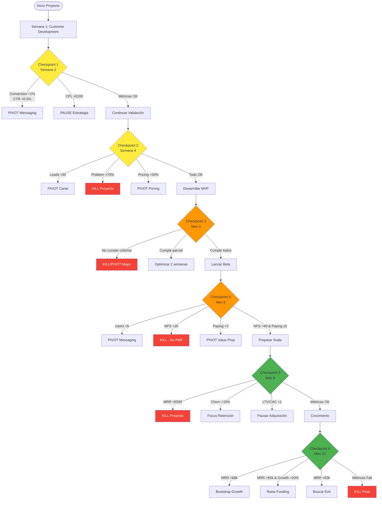
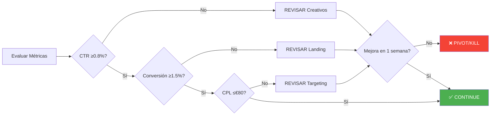
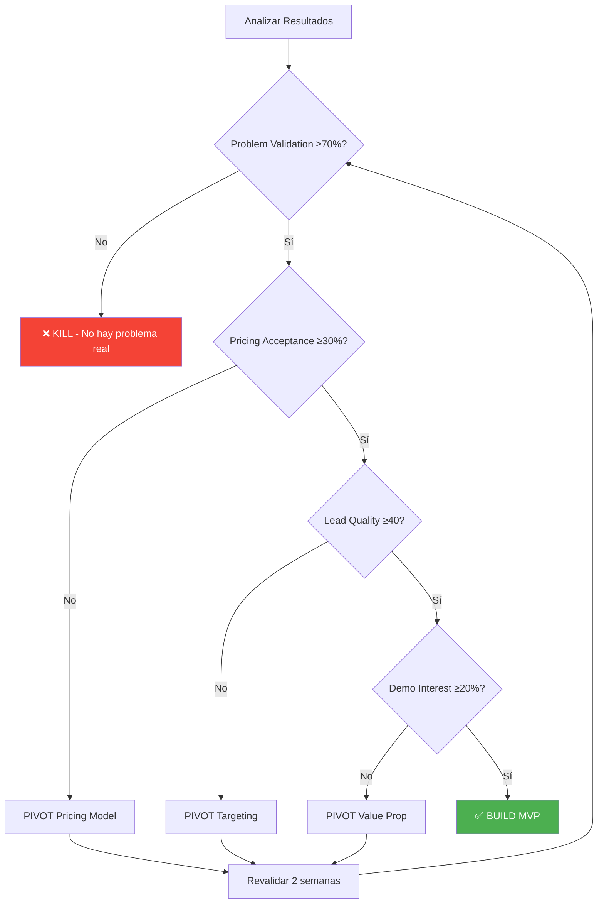
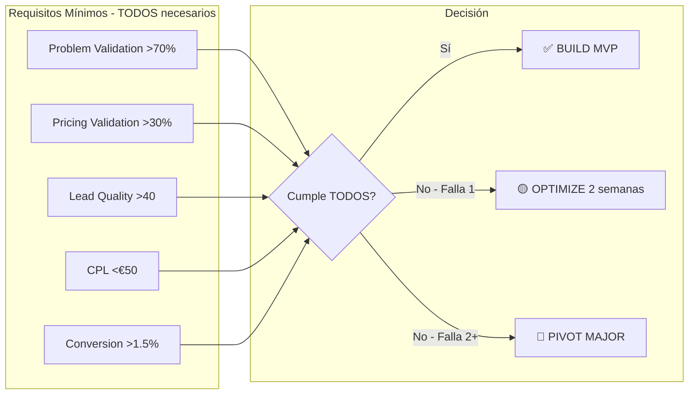
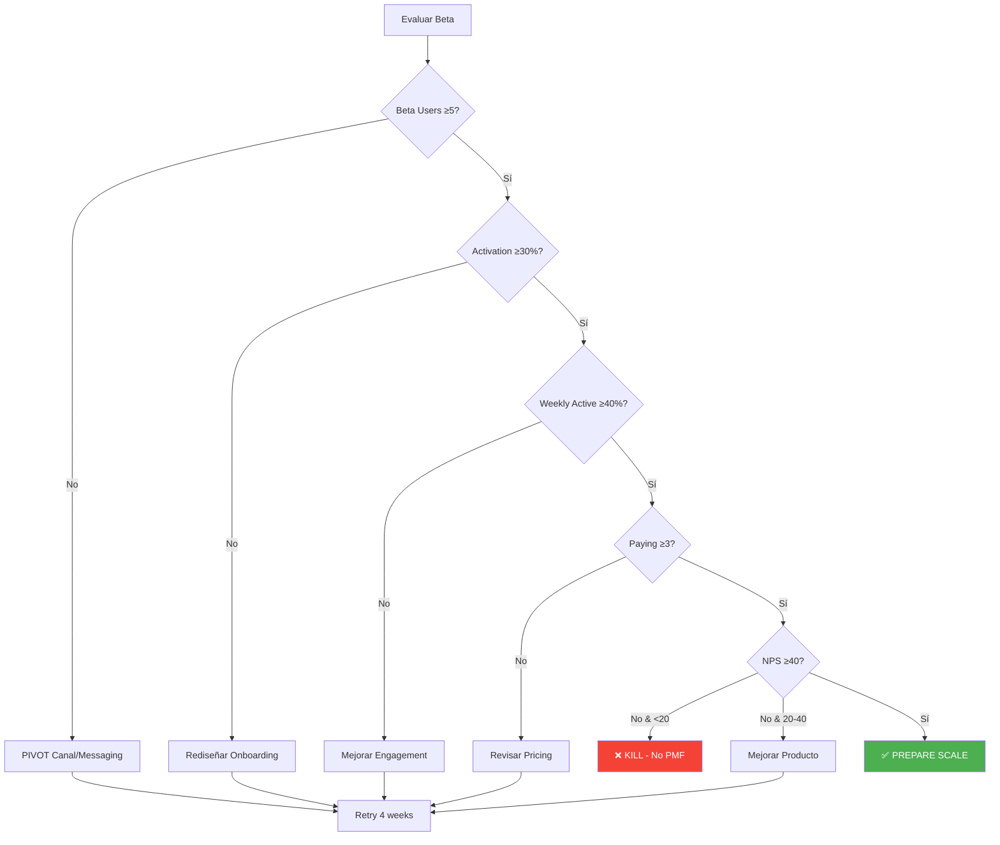
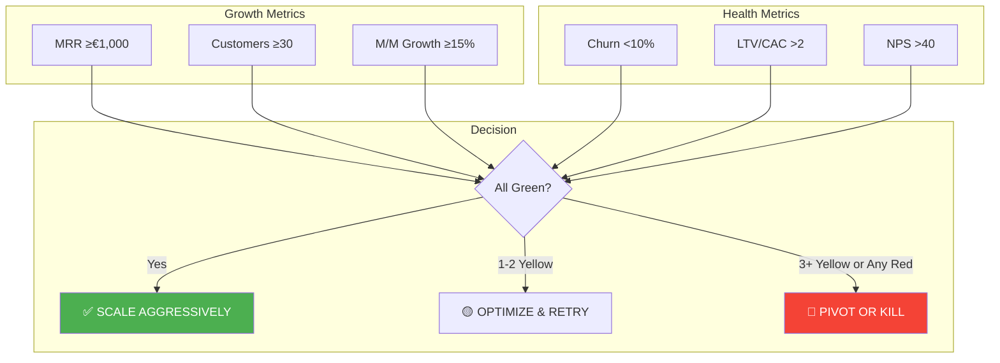
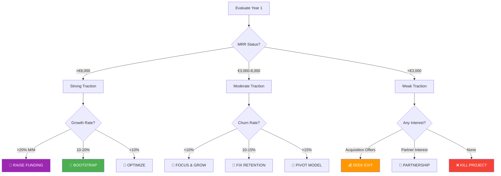
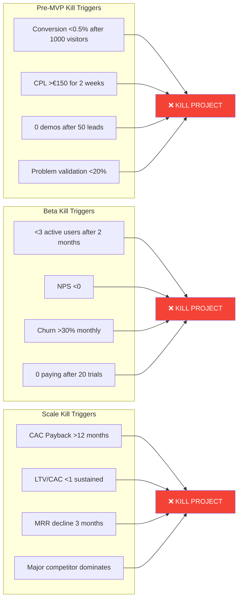
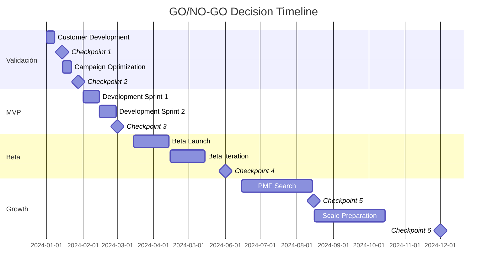

# 🚦 GO/NO-GO Decision Framework – Caetaria

## 🎯 Objetivo
Documento maestro con todos los checkpoints de decisión objetivos para evaluar la viabilidad del proyecto en cada fase.

---

## 📊 Diagrama de Flujo Maestro



---

## 🔍 CHECKPOINT 1: Validación Inicial (Semana 2)

### Objetivo
Validar interés inicial y viabilidad del canal de adquisición.

### Métricas Requeridas
```yaml
Datos mínimos necesarios:
  - Visitantes únicos: ≥500
  - Impresiones ads: ≥10,000
  - Presupuesto gastado: €200-300
```

### Criterios de Decisión



### Acciones según Resultado

| Métrica | Valor | Decisión | Acción |
|---------|-------|----------|--------|
| CTR | <0.5% | 🔴 CRÍTICO | Pausar campañas, revisar messaging |
| CTR | 0.5-0.8% | 🟡 OPTIMIZAR | A/B test nuevos creativos |
| CTR | >0.8% | 🟢 CONTINUAR | Mantener y escalar |
| Conversión | <1% | 🔴 CRÍTICO | Rediseñar landing completo |
| Conversión | 1-1.5% | 🟡 OPTIMIZAR | A/B test elementos landing |
| Conversión | >1.5% | 🟢 CONTINUAR | Escalar tráfico |
| CPL | >€100 | 🔴 CRÍTICO | Cambiar estrategia completa |
| CPL | €80-100 | 🟡 OPTIMIZAR | Refinar targeting |
| CPL | <€80 | 🟢 CONTINUAR | Aumentar presupuesto |

---

## 🔍 CHECKPOINT 2: Validación Completa (Semana 4)

### Objetivo
Confirmar problem-solution fit y disposición de pago antes de construir.

### Métricas Requeridas
```yaml
Customer Development:
  - Entrevistas completadas: ≥30
  - Surveys de pricing: ≥50
  - Leads generados: ≥50
  - Demos agendadas: ≥10
```

### Diagrama de Decisión



### Matriz de Decisión

| Criterio | Peso | Mínimo | Ideal | Resultado | Score |
|----------|------|--------|-------|-----------|-------|
| Problem Validation | 30% | 70% | 85% | _____% | _____ |
| Pricing Acceptance | 25% | 30% | 50% | _____% | _____ |
| Lead Quality | 20% | 40 | 60 | _____ | _____ |
| Demo Interest | 15% | 20% | 40% | _____% | _____ |
| Competition Weak | 10% | Yes | Yes | _____ | _____ |
| **TOTAL SCORE** | 100% | **60** | **80** | | _____ |

**Decisión**: Score ≥60 = GO | Score 40-60 = OPTIMIZE | Score <40 = KILL

---

## 🔍 CHECKPOINT 3: Go/No-Go MVP (Mes 3)

### Objetivo
Evaluar si hay suficiente validación para invertir en desarrollo del MVP.

### Criterios Consolidados



### Investment Decision Framework

```python
def mvp_investment_decision(metrics):
    """
    Decisión de inversión para MVP basada en métricas
    """
    
    required_metrics = {
        'problem_validation': 0.70,
        'pricing_acceptance': 0.30,
        'lead_quality_avg': 40,
        'cpl': 50,
        'conversion_rate': 0.015
    }
    
    failures = []
    for metric, threshold in required_metrics.items():
        if metric.startswith('cpl'):
            if metrics[metric] > threshold:
                failures.append(metric)
        else:
            if metrics[metric] < threshold:
                failures.append(metric)
    
    if len(failures) == 0:
        return {
            'decision': 'GO',
            'action': 'Proceed with MVP development',
            'budget': '€3,000',
            'timeline': '8-10 weeks'
        }
    elif len(failures) == 1:
        return {
            'decision': 'OPTIMIZE',
            'action': f'Fix {failures[0]} and retest',
            'budget': '€500',
            'timeline': '2 weeks'
        }
    else:
        return {
            'decision': 'PIVOT/KILL',
            'action': 'Major pivot needed or kill project',
            'failures': failures
        }
```

---

## 🔍 CHECKPOINT 4: Beta Success (Mes 6)

### Objetivo
Evaluar si el producto tiene tracción real con usuarios beta.

### Métricas Beta



### Beta Health Dashboard

| Métrica | Red Flag | Warning | Healthy | Target |
|---------|----------|---------|---------|---------|
| Beta Users | <5 | 5-10 | >10 | 15 |
| Activation Rate | <20% | 20-30% | >30% | 50% |
| Weekly Active | <20% | 20-40% | >40% | 60% |
| Support Tickets/User | >5 | 3-5 | <3 | <2 |
| NPS | <20 | 20-40 | >40 | >50 |
| Paying Customers | 0 | 1-2 | ≥3 | ≥5 |
| Churn Rate | >20% | 10-20% | <10% | <5% |

---

## 🔍 CHECKPOINT 5: Product-Market Fit (Mes 8)

### Objetivo
Confirmar que existe un mercado viable y sostenible.

### PMF Validation Matrix



### Unit Economics Calculator

```javascript
// Calculadora de unit economics para decisión
const unitEconomics = {
  // Inputs
  avgMonthlyRevenue: 35,  // € per customer
  avgCustomerLifespan: 12, // months
  avgAcquisitionCost: 100, // €
  
  // Calculations
  ltv: function() {
    return this.avgMonthlyRevenue * this.avgCustomerLifespan;
  },
  
  ltvCacRatio: function() {
    return this.ltv() / this.avgAcquisitionCost;
  },
  
  paybackPeriod: function() {
    return this.avgAcquisitionCost / this.avgMonthlyRevenue;
  },
  
  // Decision
  decision: function() {
    const ratio = this.ltvCacRatio();
    const payback = this.paybackPeriod();
    
    if (ratio > 3 && payback < 6) {
      return "✅ SCALE - Economics are strong";
    } else if (ratio > 2 && payback < 12) {
      return "🟡 OPTIMIZE - Improve retention or reduce CAC";
    } else {
      return "🔴 STOP - Unit economics not viable";
    }
  }
};
```

---

## 🔍 CHECKPOINT 6: Scale Decision (Mes 12)

### Objetivo
Determinar estrategia de crecimiento o salida.

### Strategic Options Tree



### Year 1 Success Criteria

| Scenario | MRR | Customers | Churn | LTV/CAC | Decision |
|----------|-----|-----------|-------|---------|----------|
| 🟢 **Best** | >€8k | >200 | <8% | >3 | Scale/Funding |
| 🟡 **Good** | €3-8k | 50-200 | <12% | >2 | Bootstrap |
| 🟠 **Marginal** | €1-3k | 20-50 | <15% | >1.5 | Optimize |
| 🔴 **Failed** | <€1k | <20 | >15% | <1 | Kill/Exit |

---

## 🚨 KILL CRITERIA (Inmediatos)

### Triggers de Cancelación Automática



---

## 📊 Sistema de Alertas Automáticas

### Configuración de Alertas por Fase

```javascript
const alertSystem = {
  // FASE 1: Validación
  validation: {
    alerts: [
      {
        metric: 'daily_spend',
        condition: '> budget * 1.2',
        action: 'PAUSE_CAMPAIGNS',
        notification: 'immediate'
      },
      {
        metric: 'conversion_rate',
        condition: '< 0.5%',
        action: 'REVIEW_LANDING',
        notification: 'daily'
      }
    ]
  },
  
  // FASE 2: MVP
  mvp: {
    alerts: [
      {
        metric: 'development_delay',
        condition: '> 1 week',
        action: 'SCOPE_REDUCTION',
        notification: 'immediate'
      },
      {
        metric: 'beta_signups',
        condition: '< 5 by week 2',
        action: 'INCREASE_OUTREACH',
        notification: 'weekly'
      }
    ]
  },
  
  // FASE 3: Growth
  growth: {
    alerts: [
      {
        metric: 'churn_rate',
        condition: '> 15%',
        action: 'CUSTOMER_INTERVIEWS',
        notification: 'immediate'
      },
      {
        metric: 'cac',
        condition: '> ltv * 0.5',
        action: 'PAUSE_PAID_ACQUISITION',
        notification: 'immediate'
      }
    ]
  }
};
```

---

## 📈 Dashboard SQL para Decisiones

### Query Maestro de Decisión Semanal

```sql
-- Dashboard de decisión GO/NO-GO
WITH weekly_metrics AS (
  SELECT 
    -- Acquisition
    COUNT(DISTINCT CASE WHEN event = 'visitor' THEN user_id END) as visitors,
    COUNT(DISTINCT CASE WHEN event = 'lead' THEN user_id END) as leads,
    AVG(CASE WHEN event = 'lead' THEN lead_score END) as avg_lead_score,
    
    -- Conversion
    ROUND(100.0 * COUNT(DISTINCT CASE WHEN event = 'lead' THEN user_id END) / 
          NULLIF(COUNT(DISTINCT CASE WHEN event = 'visitor' THEN user_id END), 0), 2) as conversion_rate,
    
    -- Cost
    SUM(CASE WHEN source = 'paid' THEN cost END) as total_spend,
    SUM(CASE WHEN source = 'paid' THEN cost END) / 
        NULLIF(COUNT(DISTINCT CASE WHEN event = 'lead' THEN user_id END), 0) as cpl,
    
    -- Engagement (Beta only)
    COUNT(DISTINCT CASE WHEN event = 'active_user' THEN user_id END) as active_users,
    AVG(CASE WHEN event = 'nps_response' THEN score END) as nps_score,
    
    -- Revenue (Post-Beta)
    COUNT(DISTINCT CASE WHEN event = 'payment' THEN user_id END) as paying_customers,
    SUM(CASE WHEN event = 'payment' THEN amount END) as revenue
    
  FROM events
  WHERE timestamp >= CURRENT_DATE - INTERVAL '7 days'
),
decision_logic AS (
  SELECT 
    *,
    -- Decision rules
    CASE 
      -- Validation Phase
      WHEN visitors > 100 AND conversion_rate < 1 THEN 'PIVOT_LANDING'
      WHEN leads > 20 AND avg_lead_score < 40 THEN 'PIVOT_TARGETING'
      WHEN cpl > 100 THEN 'PAUSE_ADS'
      
      -- Beta Phase
      WHEN active_users < 5 AND leads > 50 THEN 'PIVOT_PRODUCT'
      WHEN nps_score < 20 AND active_users > 5 THEN 'KILL_PROJECT'
      
      -- Growth Phase
      WHEN paying_customers > 10 AND revenue/total_spend < 1 THEN 'OPTIMIZE_PRICING'
      WHEN paying_customers > 30 AND revenue/total_spend > 3 THEN 'SCALE'
      
      ELSE 'CONTINUE'
    END as recommended_action,
    
    -- Confidence level
    CASE 
      WHEN visitors < 100 OR leads < 10 THEN 'LOW'
      WHEN visitors < 500 OR leads < 50 THEN 'MEDIUM'
      ELSE 'HIGH'
    END as confidence_level
    
  FROM weekly_metrics
)
SELECT 
  *,
  -- Add urgency flag
  CASE 
    WHEN recommended_action IN ('KILL_PROJECT', 'PAUSE_ADS') THEN '🔴 URGENT'
    WHEN recommended_action LIKE 'PIVOT%' THEN '🟡 HIGH'
    WHEN recommended_action = 'SCALE' THEN '🟢 OPPORTUNITY'
    ELSE '⚪ NORMAL'
  END as urgency
FROM decision_logic;
```

---

## ✅ Checklist de Decisión Rápida

### Usar en cada checkpoint:

- [ ] ¿Tenemos suficientes datos? (n > mínimo requerido)
- [ ] ¿Los datos son estadísticamente significativos?
- [ ] ¿Hemos eliminado outliers y anomalías?
- [ ] ¿Las métricas son consistentes en el tiempo?
- [ ] ¿Hemos validado con datos cualitativos?
- [ ] ¿El equipo está alineado con la decisión?
- [ ] ¿Tenemos recursos para ejecutar la decisión?
- [ ] ¿Hemos documentado la decisión y rationale?

### Matriz de Decisión Rápida

| Si tu... | Y tu... | Entonces... |
|----------|---------|-------------|
| Conversión <1% | CPL >€100 | **KILL** - No hay fit |
| Conversión 1-2% | CPL €50-100 | **OPTIMIZE** - Hay potencial |
| Conversión >2% | CPL <€50 | **SCALE** - Acelera |
| NPS <20 | Churn >20% | **KILL** - No hay PMF |
| NPS 20-40 | Churn 10-20% | **ITERATE** - Mejorar producto |
| NPS >40 | Churn <10% | **GROW** - Tienes PMF |
| MRR crece <10% | CAC crece >20% | **PAUSE** - Optimiza economics |
| MRR crece >20% | CAC estable | **INVEST** - Acelera crecimiento |

---

## 📅 Timeline de Checkpoints



---

## 🎯 Resumen Ejecutivo

### Los 6 Checkpoints Clave:

1. **Semana 2**: Validación canal (CTR, Conversión, CPL)
2. **Semana 4**: Problem-Solution Fit (70% validation)
3. **Mes 3**: MVP Investment Decision (5 criterios)
4. **Mes 6**: Beta Success (Users, NPS, Paying)
5. **Mes 8**: Product-Market Fit (MRR, Churn, LTV/CAC)
6. **Mes 12**: Scale Strategy (Bootstrap/Funding/Exit)

### Regla de Oro:
> "Si dudas entre continuar o parar, **los datos deben ser convincentemente positivos** para continuar. En caso de duda, pivota o mata el proyecto."

---

*Documento actualizado: Agosto 2025*
*Próxima revisión: En cada checkpoint*